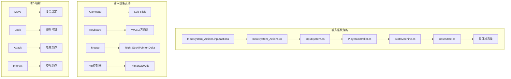
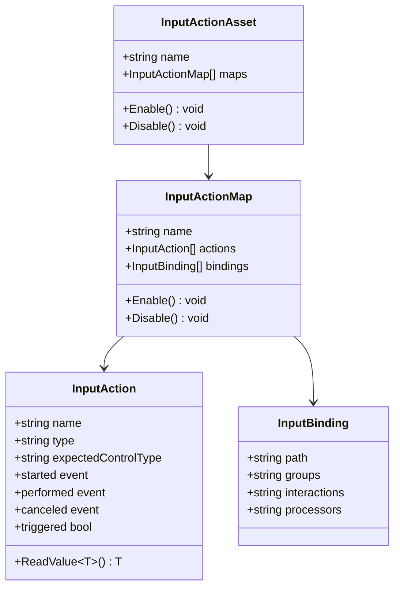
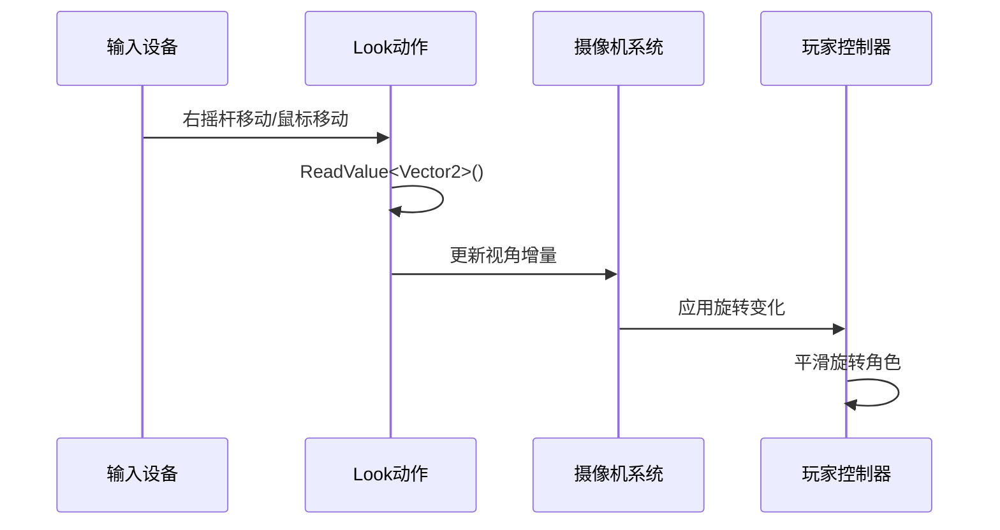
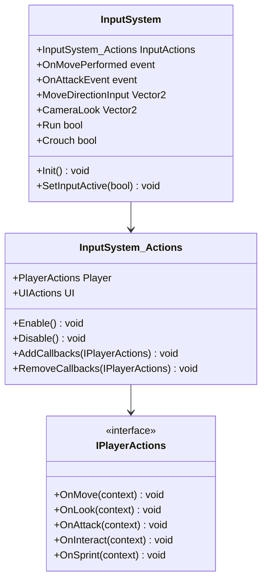
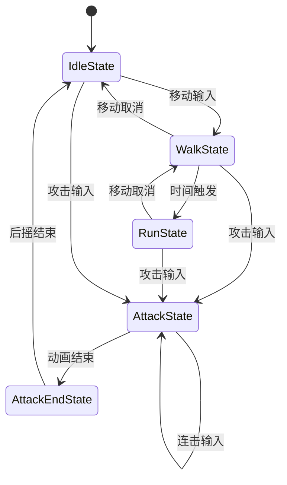
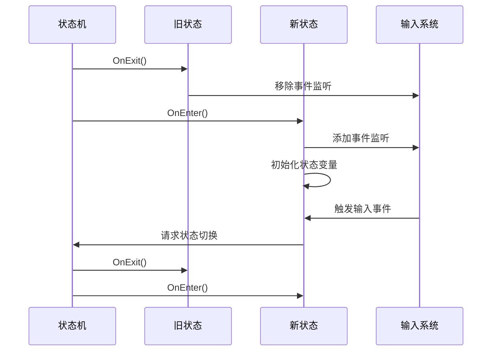

# 玩家输入映射

<cite>
**本文档中引用的文件**
- [InputSystem_Actions.inputactions](file://Assets/InputSystem_Actions.inputactions)
- [InputSystem_Actions.cs](file://Assets/InputSystem_Actions.cs)
- [InputSystem.cs](file://Assets/Scripts/Manager/InputSystem/InputSystem.cs)
- [PlayerController.cs](file://Assets/Scripts/Controller/PlayerController.cs)
- [StateMachine.cs](file://Assets/Scripts/Controller/FSM/StateMachine.cs)
- [BaseState.cs](file://Assets/Scripts/Controller/FSM/BaseState.cs)
- [AttackState.cs](file://Assets/Scripts/Controller/FSM/CharacterState/AttackState.cs)
- [WalkState.cs](file://Assets/Scripts/Controller/FSM/CharacterState/WalkState.cs)
- [RunState.cs](file://Assets/Scripts/Controller/FSM/CharacterState/RunState.cs)
- [CameraSystem.cs](file://Assets/Scripts/Manager/CameraSystem/CameraSystem.cs)
</cite>

## 目录
1. [简介](#简介)
2. [项目结构概览](#项目结构概览)
3. [Player Action Map 核心架构](#player-action-map-核心架构)
4. [动作类型与绑定机制](#动作类型与绑定机制)
5. [Move动作的复合绑定](#move动作的复合绑定)
6. [Look动作的视角控制](#look动作的视角控制)
7. [其他核心动作映射](#其他核心动作映射)
8. [输入系统管理器](#输入系统管理器)
9. [状态机与输入处理](#状态机与输入处理)
10. [最佳实践代码示例](#最佳实践代码示例)
11. [故障排除指南](#故障排除指南)
12. [总结](#总结)

## 简介

本文档详细介绍了Unity项目中Player Action Map的配置与实现。该系统采用Unity Input System框架，提供了灵活且可扩展的输入映射机制，支持多种输入设备（游戏手柄、键盘、鼠标、VR控制器等）的统一处理。

Player Action Map定义了游戏中的核心交互动作，包括移动、视角控制、攻击、交互、冲刺、蹲伏等各种玩家行为。系统通过分层的架构设计，实现了从底层输入设备到高层游戏逻辑的完整映射链路。

## 项目结构概览



**图表来源**
- [InputSystem_Actions.inputactions](file://Assets/InputSystem_Actions.inputactions#L1-L50)
- [InputSystem_Actions.cs](file://Assets/InputSystem_Actions.cs#L1-L100)

## Player Action Map 核心架构

Player Action Map是整个输入系统的核心，它定义了所有玩家相关的输入动作及其对应的绑定配置。

### 架构层次



**图表来源**
- [InputSystem_Actions.cs](file://Assets/InputSystem_Actions.cs#L1302-L1334)
- [InputSystem_Actions.inputactions](file://Assets/InputSystem_Actions.inputactions#L1-L100)

### 核心动作定义

Player Action Map包含以下核心动作：

| 动作名称 | 类型 | 预期控制类型 | 描述 |
|---------|------|-------------|------|
| Move | Value | Vector2 | 移动方向输入，支持复合绑定 |
| Look | Value | Vector2 | 视角控制输入 |
| Attack | Button | Button | 攻击动作触发 |
| Interact | Button | Button | 交互动作触发（带Hold交互） |
| Crouch | Button | Button | 蹲伏动作触发 |
| Sprint | Button | Button | 冲刺动作触发 |
| Previous | Button | Button | 上一个物品选择 |
| Next | Button | Button | 下一个物品选择 |

**节来源**
- [InputSystem_Actions.inputactions](file://Assets/InputSystem_Actions.inputactions#L10-L100)
- [InputSystem_Actions.cs](file://Assets/InputSystem_Actions.cs#L1211-L1232)

## 动作类型与绑定机制

### 动作类型详解

#### Value类型动作
- **Move**: 值类型动作，返回Vector2方向向量
- **Look**: 值类型动作，返回Vector2视角增量
- **预期控制类型**: Vector2

#### Button类型动作  
- **Attack**: 按钮类型动作，表示按下/释放事件
- **Interact**: 按钮类型动作，支持Hold交互
- **Crouch/Sprint/Previous/Next**: 按钮类型动作
- **预期控制类型**: Button

#### 控制类型含义
- **Vector2**: 表示二维向量输入，常用于移动和视角控制
- **Button**: 表示布尔值输入，常用于动作触发
- **PassThrough**: 直通类型，不进行特殊处理

### 绑定组机制

系统支持多种绑定组来区分不同的输入设备：

- **Gamepad**: 游戏手柄专用绑定
- **Keyboard&Mouse**: 键盘鼠标专用绑定  
- **Joystick**: 外接手柄绑定
- **XR**: VR控制器绑定
- **Touch**: 触摸屏绑定

**节来源**
- [InputSystem_Actions.inputactions](file://Assets/InputSystem_Actions.inputactions#L100-L200)
- [InputSystem_Actions.cs](file://Assets/InputSystem_Actions.cs#L1178-L1211)

## Move动作的复合绑定

Move动作是游戏中最复杂的动作之一，采用了复合绑定机制来支持多种输入设备的统一处理。

### 复合绑定结构

```mermaid
flowchart TD
A[Move动作] --> B[复合绑定 WASD]
A --> C[Gamepad左摇杆]
A --> D[VR控制器2D轴]
A --> E[外接手柄摇杆]
B --> F[W键 up]
B --> G[↑箭头 down]
B --> H[A键 left]
B --> I[D键 right]
C --> J[<Gamepad>/leftStick]
D --> K[<XRController>/{Primary2DAxis}]
E --> L[<Joystick>/stick]
F --> M[组合成Vector2输出]
G --> M
H --> M
I --> M
J --> M
K --> M
L --> M
```

**图表来源**
- [InputSystem_Actions.inputactions](file://Assets/InputSystem_Actions.inputactions#L100-L200)

### 具体绑定配置

#### WASD复合绑定
- **名称**: WASD
- **路径**: Dpad
- **组成部分**:
  - W键: up方向
  - ↑箭头: down方向  
  - A键: left方向
  - D键: right方向
  - ↓箭头: down方向

#### 游戏手柄绑定
- **Gamepad左摇杆**: `<Gamepad>/leftStick`
- **VR控制器2D轴**: `<XRController>/{Primary2DAxis}`
- **外接手柄摇杆**: `<Joystick>/stick`

### 复合绑定的工作原理

复合绑定通过将多个独立的按键绑定组合成一个动作，系统会自动计算这些按键的矢量合成结果，最终输出一个标准化的Vector2向量。

**节来源**
- [InputSystem_Actions.inputactions](file://Assets/InputSystem_Actions.inputactions#L100-L200)

## Look动作的视角控制

Look动作负责处理玩家的视角控制，支持多种输入设备的视角调整。

### 视角控制绑定



**图表来源**
- [InputSystem_Actions.inputactions](file://Assets/InputSystem_Actions.inputactions#L200-L300)
- [PlayerController.cs](file://Assets/Scripts/Controller/PlayerController.cs#L60-L75)

### 绑定配置详情

#### 游戏手柄视角绑定
- **路径**: `<Gamepad>/rightStick`
- **绑定组**: `;Gamepad`
- **预期控制类型**: Vector2

#### 鼠标视角绑定
- **路径**: `<Pointer>/delta`
- **绑定组**: `;Keyboard&Mouse;Touch`
- **预期控制类型**: Vector2

#### 外接手柄视角绑定
- **路径**: `<Joystick>/{Hatswitch}`
- **绑定组**: `Joystick`
- **预期控制类型**: Vector2

### 视角控制实现

视角控制通过以下步骤实现：

1. **读取输入值**: 使用`InputActions.Player.Look.ReadValue<Vector2>()`
2. **转换坐标系**: 将输入值转换为游戏世界的旋转增量
3. **平滑处理**: 应用旋转速度限制和平滑插值
4. **应用变换**: 更新玩家角色和摄像机的旋转

**节来源**
- [InputSystem_Actions.inputactions](file://Assets/InputSystem_Actions.inputactions#L200-L300)
- [InputSystem.cs](file://Assets/Scripts/Manager/InputSystem/InputSystem.cs#L70-L90)

## 其他核心动作映射

### Attack动作映射

Attack动作支持多种输入设备的攻击触发：

| 设备类型 | 绑定路径 | 绑定组 | 特殊处理 |
|---------|----------|--------|----------|
| 游戏手柄 | `<Gamepad>/buttonWest` | `;Gamepad` | 默认攻击按钮 |
| 鼠标 | `<Mouse>/leftButton` | `;Keyboard&Mouse` | 左键点击 |
| 键盘 | `<Keyboard>/enter` | `Keyboard&Mouse` | 回车键 |
| VR控制器 | `<XRController>/{PrimaryAction}` | `XR` | 主要动作 |
| 外接手柄 | `<Joystick>/trigger` | `Joystick` | 触发器 |
| 触摸屏 | `<Touchscreen>/primaryTouch/tap` | `;Touch` | 轻触 |

### Interact动作映射

Interact动作使用Hold交互，支持长时间按住触发：

- **绑定路径**: `<Keyboard>/e`
- **绑定组**: `Keyboard&Mouse`
- **交互类型**: Hold
- **预期控制类型**: Button

### Sprint动作映射

Sprint动作支持快速移动：

- **键盘绑定**: `<Keyboard>/leftShift`
- **游戏手柄绑定**: `<Gamepad>/leftStickPress`
- **VR绑定**: `<XRController>/trigger`
- **绑定组**: 多种设备组

**节来源**
- [InputSystem_Actions.inputactions](file://Assets/InputSystem_Actions.inputactions#L300-L500)

## 输入系统管理器

InputSystem类作为输入系统的中央管理器，负责协调各个输入动作的生命周期和事件处理。

### 管理器架构



**图表来源**
- [InputSystem.cs](file://Assets/Scripts/Manager/InputSystem/InputSystem.cs#L1-L50)
- [InputSystem_Actions.cs](file://Assets/InputSystem_Actions.cs#L1302-L1334)

### 初始化流程

```mermaid
flowchart TD
A[创建InputSystem实例] --> B[初始化InputActions]
B --> C[设置回调事件]
C --> D[注册Move事件]
D --> E[注册Attack事件]
E --> F[注册其他事件]
F --> G[启用输入系统]
G --> H[OnEnable事件]
H --> I[SetInputActive(true)]
I --> J[状态机启用]
```

**图表来源**
- [InputSystem.cs](file://Assets/Scripts/Manager/InputSystem/InputSystem.cs#L40-L70)

### 事件处理机制

InputSystem提供了完整的事件处理机制：

- **OnMovePerformed**: 移动开始事件
- **OnMoveCanceled**: 移动取消事件  
- **OnAttackEvent**: 攻击事件
- **OnEvadeEvent**: 冲刺事件
- **OnWalkEvent**: 走行事件
- **OnBigSkillEvent**: 大技能事件

**节来源**
- [InputSystem.cs](file://Assets/Scripts/Manager/InputSystem/InputSystem.cs#L25-L94)

## 状态机与输入处理

PlayerController通过状态机模式管理玩家的各种行为状态，每个状态都负责处理特定的输入事件。

### 状态机架构



**图表来源**
- [StateMachine.cs](file://Assets/Scripts/Controller/FSM/StateMachine.cs#L40-L60)
- [BaseState.cs](file://Assets/Scripts/Controller/FSM/BaseState.cs#L48-L84)

### 状态切换机制

状态机通过以下方式处理输入：

1. **输入事件捕获**: 从InputSystem接收输入事件
2. **状态验证**: 检查当前状态是否允许状态切换
3. **状态锁定**: 防止频繁的状态切换
4. **状态变更**: 执行状态的进入和退出逻辑

### 状态生命周期

每个状态都有完整的生命周期管理：



**图表来源**
- [StateMachine.cs](file://Assets/Scripts/Controller/FSM/StateMachine.cs#L40-L60)

**节来源**
- [StateMachine.cs](file://Assets/Scripts/Controller/FSM/StateMachine.cs#L1-L115)
- [BaseState.cs](file://Assets/Scripts/Controller/FSM/BaseState.cs#L1-L100)

## 最佳实践代码示例

### PlayerController启用与禁用

```csharp
// PlayerController.cs - 启用和禁用输入系统
private void OnEnable()
{
    // 启用状态机
    _stateMachine.Enable();
    
    // 启用输入系统
    SetInputActive(true);
}

private void OnDisable()
{
    // 禁用状态机
    _stateMachine.Disable();
    
    // 禁用输入系统
    SetInputActive(false);
}

public void SetInputActive(bool value)
{
    // 统一管理组件启用状态
    this.enabled = value;
    
    // 确保状态机同步启用/禁用
    if (value)
    {
        _stateMachine.Enable();
    }
    else
    {
        _stateMachine.Disable();
    }
}
```

### 回调接口实现

```csharp
// 实现IPlayerActions接口
public class PlayerController : MonoBehaviour, IPlayerActions
{
    // 实现Move回调
    public void OnMove(InputAction.CallbackContext context)
    {
        if (context.phase == InputActionPhase.Performed)
        {
            var moveValue = context.ReadValue<Vector2>();
            // 处理移动输入
            Debug.Log($"移动输入: {moveValue}");
        }
    }
    
    // 实现Look回调
    public void OnLook(InputAction.CallbackContext context)
    {
        if (context.phase == InputActionPhase.Performed)
        {
            var lookValue = context.ReadValue<Vector2>();
            // 处理视角输入
            ApplyCameraRotation(lookValue);
        }
    }
    
    // 实现Attack回调
    public void OnAttack(InputAction.CallbackContext context)
    {
        if (context.phase == InputActionPhase.Performed)
        {
            // 触发攻击状态
            _stateMachine.ChangeState<AttackState>();
        }
    }
}
```

### 状态机启用/禁用管理

```csharp
// StateMachine.cs - 状态机生命周期管理
public void Enable()
{
    if (_isEnabled) return;
    _isEnabled = true;
    
    // 恢复输入
    _playerController.SetInputActive(true);
    
    // 重新进入当前状态（可选）
    _currentState?.OnEnter();
}

public void Disable()
{
    if (!_isEnabled) return;
    _isEnabled = false;
    
    // 立即屏蔽一切输入
    _playerController.SetInputActive(false);
    
    // 可选：让当前状态暂停
    _currentState?.OnExit();
}
```

### 输入系统初始化

```csharp
// InputSystem.cs - 完整的初始化流程
public void Init()
{
    // 注册Move事件
    InputActions.Player.Move.performed += ctx =>
    {
        OnMovePerformed?.Invoke(ctx);
        GameEvents.OnInput?.OnNext(new InputEvent());
    };
    
    // 注册Move取消事件
    InputActions.Player.Move.canceled += ctx => 
        OnMoveCanceled?.Invoke(ctx);
    
    // 注册攻击事件
    InputActions.Player.Attack.performed += ctx => 
        OnAttackEvent?.Invoke(ctx);
    
    // 注册冲刺事件
    InputActions.Player.Run.performed += ctx => 
        OnEvadeEvent?.Invoke(ctx);
    
    // 启用输入系统
    InputActions.Enable();
}
```

**节来源**
- [PlayerController.cs](file://Assets/Scripts/Controller/PlayerController.cs#L75-L102)
- [InputSystem.cs](file://Assets/Scripts/Manager/InputSystem/InputSystem.cs#L40-L70)
- [StateMachine.cs](file://Assets/Scripts/Controller/FSM/StateMachine.cs#L86-L114)

## 故障排除指南

### 常见问题与解决方案

#### 1. 输入无响应问题

**症状**: 玩家无法移动或执行动作

**排查步骤**:
- 检查InputSystem是否正确初始化
- 验证Player Action Map是否启用
- 确认绑定组配置是否正确
- 检查回调函数是否正确注册

**解决方案**:
```csharp
// 确保在Awake中正确初始化
void Awake()
{
    InputSystem.Instance.Init();
    InputSystem.Instance.InputActions.Player.Enable();
}
```

#### 2. 移动方向错误

**症状**: 移动方向与预期相反

**排查步骤**:
- 检查WASD绑定的方向映射
- 验证复合绑定的权重设置
- 确认输入值的正负号

**解决方案**:
```csharp
// 在处理移动输入时添加调试信息
public void OnMove(InputAction.CallbackContext context)
{
    var moveValue = context.ReadValue<Vector2>();
    Debug.Log($"原始移动输入: {moveValue}");
    
    // 根据需要调整输入值
    moveValue = new Vector2(moveValue.x, -moveValue.y);
}
```

#### 3. 视角控制不流畅

**症状**: 视角旋转跳跃或不平滑

**排查步骤**:
- 检查Look动作的输入值范围
- 验证旋转速度参数设置
- 确认时间缩放的影响

**解决方案**:
```csharp
// 在PlayerController中优化视角处理
public void SetCharacterRotation()
{
    var input = InputSystem.Instance.CameraLook;
    
    // 添加输入过滤
    if (Mathf.Abs(input.x) < 0.01f && Mathf.Abs(input.y) < 0.01f)
        return;
    
    // 应用平滑旋转
    var targetRotation = Quaternion.Euler(
        -input.y * RotationSpeed, 
        input.x * RotationSpeed, 
        0f
    );
    
    transform.rotation = Quaternion.Slerp(
        transform.rotation, 
        targetRotation, 
        Time.deltaTime * RotationSpeed
    );
}
```

#### 4. 状态机事件冲突

**症状**: 状态切换过于频繁或不响应

**排查步骤**:
- 检查状态锁定机制
- 验证事件优先级
- 确认状态机启用状态

**解决方案**:
```csharp
// 在BaseState中添加状态锁定保护
protected virtual void OnMove(InputAction.CallbackContext ctx)
{
    if (StateMachine.StateLocked || !StateMachine.IsEnabled)
        return;
    
    // 执行状态切换逻辑
    StateMachine.ChangeState<WalkState>();
}
```

### 性能优化建议

1. **输入事件去重**: 避免重复注册相同的回调函数
2. **状态机优化**: 及时移除不需要的事件监听
3. **输入值缓存**: 缓存常用的输入值避免重复读取
4. **异步处理**: 对于耗时的输入处理使用协程

**节来源**
- [InputSystem.cs](file://Assets/Scripts/Manager/InputSystem/InputSystem.cs#L1-L94)
- [StateMachine.cs](file://Assets/Scripts/Controller/FSM/StateMachine.cs#L86-L114)

## 总结

Player Action Map系统为游戏提供了强大而灵活的输入处理能力。通过分层的架构设计，系统实现了从底层输入设备到高层游戏逻辑的完整映射链路。

### 关键特性

1. **多设备支持**: 统一处理游戏手柄、键盘、鼠标、VR控制器等多种输入设备
2. **复合绑定**: Move动作支持WASD键和摇杆的复合输入
3. **事件驱动**: 基于回调机制的事件处理，支持细粒度的状态控制
4. **状态管理**: 通过状态机模式管理复杂的游戏行为
5. **性能优化**: 提供输入系统的启用/禁用机制，支持动态开关

### 设计优势

- **可扩展性**: 易于添加新的输入动作和绑定配置
- **可维护性**: 分离关注点，清晰的职责划分
- **可测试性**: 通过接口抽象支持单元测试
- **灵活性**: 支持运行时重新绑定和配置修改

该系统为现代游戏开发提供了坚实的基础，能够满足各种输入需求，同时保持良好的性能和可维护性。