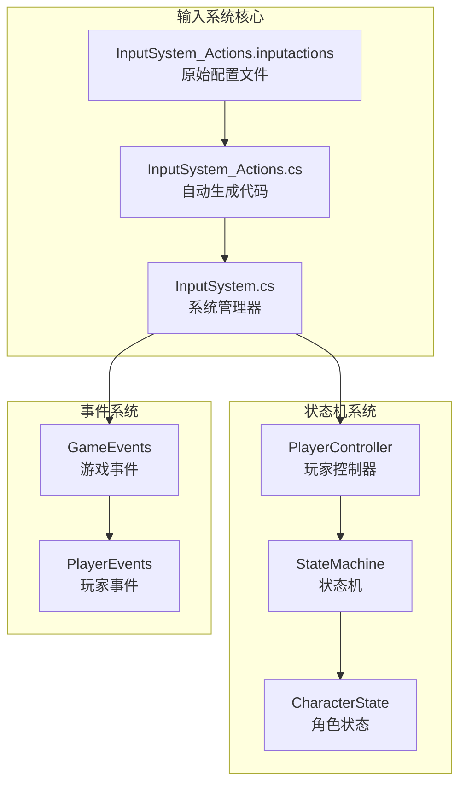
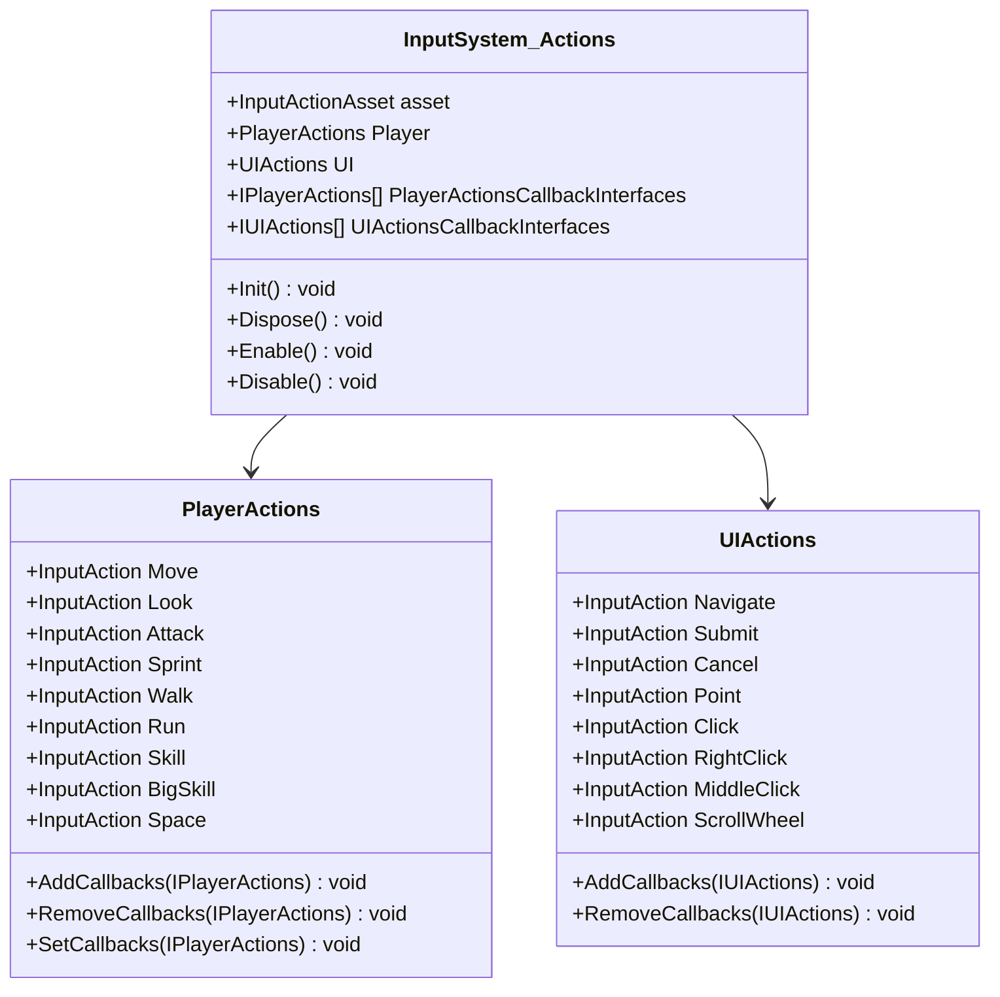
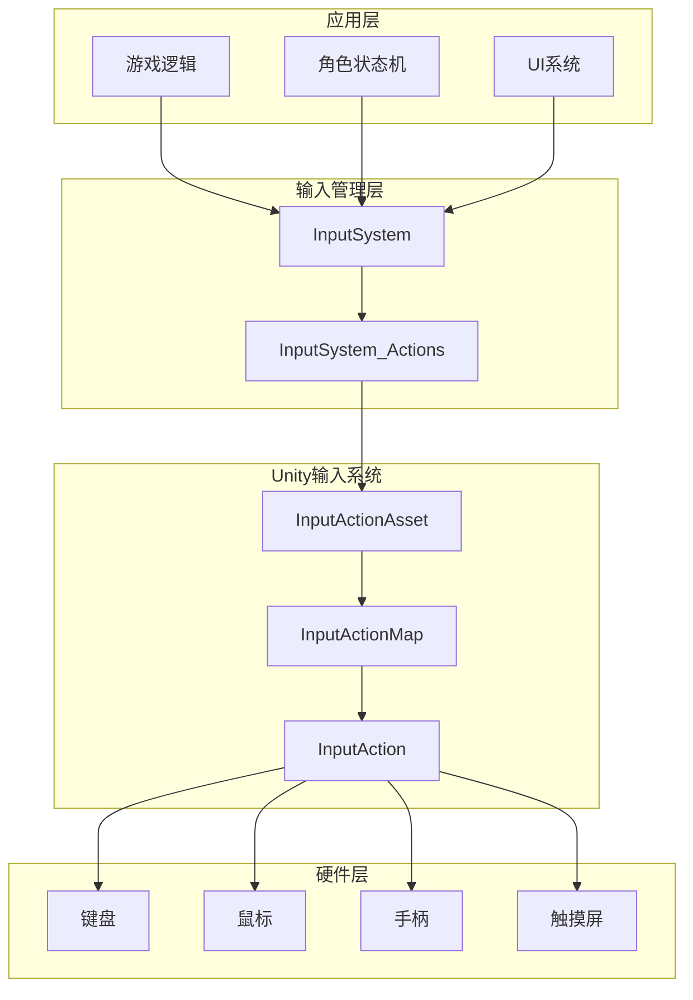
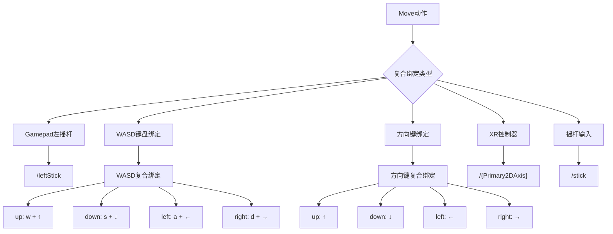
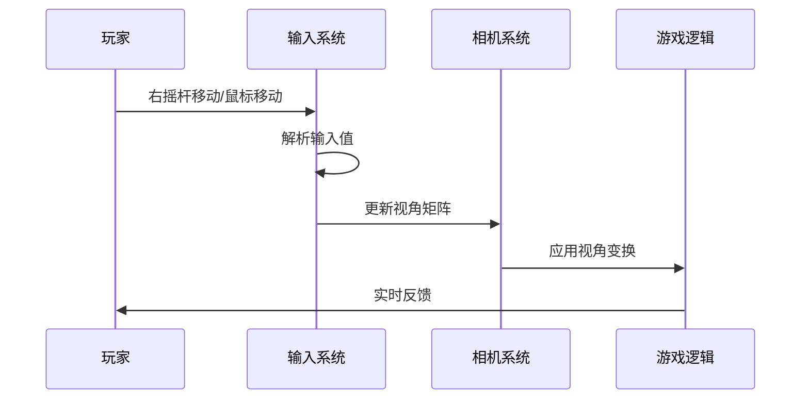
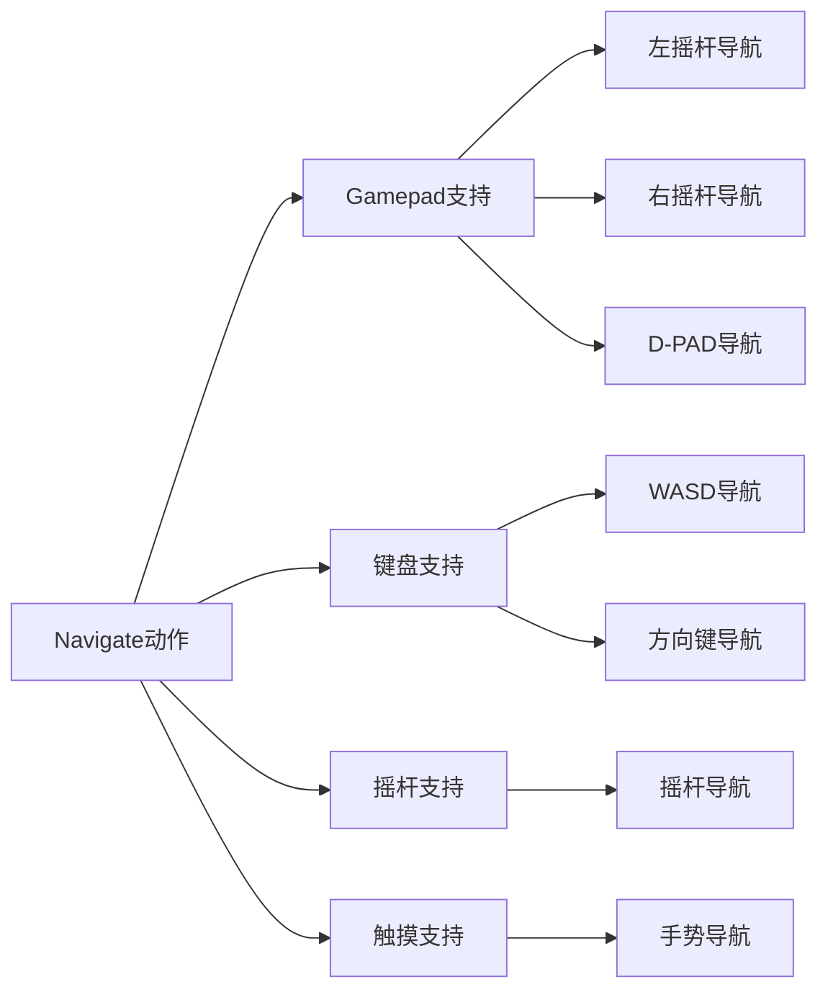
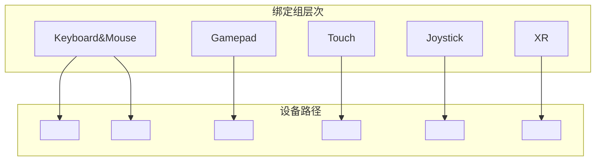

# 输入动作配置详细文档

<cite>
**本文档中引用的文件**
- [InputSystem_Actions.cs](file://Assets/InputSystem_Actions.cs)
- [InputSystem_Actions.inputactions](file://Assets/InputSystem_Actions.inputactions)
- [InputSystem.cs](file://Assets/Scripts/Manager/InputSystem/InputSystem.cs)
</cite>

## 目录
1. [简介](#简介)
2. [项目结构概述](#项目结构概述)
3. [核心组件分析](#核心组件分析)
4. [架构概览](#架构概览)
5. [Player Action Map详细分析](#player-action-map详细分析)
6. [UI Action Map详细分析](#ui-action-map详细分析)
7. [输入绑定机制](#输入绑定机制)
8. [控制方案配置](#控制方案配置)
9. [使用示例](#使用示例)
10. [扩展和修改指南](#扩展和修改指南)
11. [故障排除](#故障排除)
12. [总结](#总结)

## 简介

InputSystem_Actions是Unity项目中的核心输入系统配置资产，它定义了一套完整的玩家和UI输入动作配置。该系统基于Unity的Input System Package，提供了高度可定制的输入绑定机制，支持多种输入设备（键盘、鼠标、手柄、触摸屏等）和复杂的复合绑定结构。

本文档将深入解析该自动生成类如何定义Player和UI两个Action Map，详细说明各个核心动作的配置细节，并提供开发者修改和扩展输入绑定的实践指南。

## 项目结构概述

该项目采用模块化的输入系统架构，主要包含以下关键文件：



**图表来源**
- [InputSystem_Actions.inputactions](file://Assets/InputSystem_Actions.inputactions#L1-L50)
- [InputSystem_Actions.cs](file://Assets/InputSystem_Actions.cs#L1-L50)
- [InputSystem.cs](file://Assets/Scripts/Manager/InputSystem/InputSystem.cs#L1-L30)

**章节来源**
- [InputSystem_Actions.inputactions](file://Assets/InputSystem_Actions.inputactions#L1-L100)
- [InputSystem_Actions.cs](file://Assets/InputSystem_Actions.cs#L1-L100)

## 核心组件分析

### 自动生成类结构

InputSystem_Actions是一个部分类（partial class），由Unity的InputActionCodeGenerator自动生成。该类提供了对InputActionAsset、InputActionMap、InputAction和InputControlScheme实例的程序化访问。



**图表来源**
- [InputSystem_Actions.cs](file://Assets/InputSystem_Actions.cs#L1302-L1334)
- [InputSystem_Actions.cs](file://Assets/InputSystem_Actions.cs#L1532-L1564)

### 接口定义

系统定义了两个主要的回调接口，用于处理不同的输入事件：

- **IPlayerActions**: 处理玩家相关的输入动作
- **IUIActions**: 处理UI交互相关的输入动作

**章节来源**
- [InputSystem_Actions.cs](file://Assets/InputSystem_Actions.cs#L1791-L1811)
- [InputSystem_Actions.cs](file://Assets/InputSystem_Actions.cs#L1611-L1634)

## 架构概览

InputSystem采用分层架构设计，确保输入系统的灵活性和可扩展性：



**图表来源**
- [InputSystem.cs](file://Assets/Scripts/Manager/InputSystem/InputSystem.cs#L1-L30)
- [InputSystem_Actions.cs](file://Assets/InputSystem_Actions.cs#L1302-L1334)

## Player Action Map详细分析

Player Action Map包含了所有与玩家角色直接相关的输入动作，涵盖了移动、视角控制、战斗技能等多个方面。

### 动作类型分类

| 动作名称 | 类型 | 预期控制类型 | 描述 |
|---------|------|------------|------|
| Move | Value | Vector2 | 移动方向输入，支持复合绑定 |
| Look | Value | Vector2 | 视角控制输入 |
| Attack | Button | Button | 攻击动作触发 |
| Interact | Button | Button | 交互动作（带Hold交互） |
| Crouch | Button | Button | 蹲下动作 |
| Sprint | Button | Button | 冲刺动作 |
| Walk | Button | Button | 走路模式切换 |
| Run | Button | Button | 跑步动作 |
| Skill | Button | Button | 普通技能 |
| BigSkill | Button | Button | 大招技能 |
| Space | Button | Button | 角色切换 |

### Move动作：复合绑定机制的核心

Move动作是最复杂和灵活的动作之一，采用了复合绑定（Composite Binding）机制，支持多种输入设备的组合：



**图表来源**
- [InputSystem_Actions.inputactions](file://Assets/InputSystem_Actions.inputactions#L180-L280)

#### WASD复合绑定详解

WASD复合绑定通过多个独立的按键绑定组合成一个矢量输入：

- **上方向**: W键或上箭头键
- **下方向**: S键或下箭头键  
- **左方向**: A键或左箭头键
- **右方向**: D键或右箭头键

这种设计允许玩家根据个人习惯选择不同的按键组合，同时保持一致的输入行为。

#### Gamepad左摇杆绑定

直接绑定到Gamepad的leftStick，提供直观的手柄操作体验。该绑定具有以下特点：
- 自然的模拟输入响应
- 支持任意角度的方向控制
- 符合手柄操作习惯

### Look动作：多设备视角控制

Look动作负责处理视角旋转控制，支持多种输入设备：



**图表来源**
- [InputSystem_Actions.inputactions](file://Assets/InputSystem_Actions.inputactions#L280-L320)

#### 绑定配置分析

- **Gamepad右摇杆**: `<Gamepad>/rightStick`
- **鼠标移动**: `<Pointer>/delta`
- **摇杆帽子开关**: `<Joystick>/{Hatswitch}`

这些绑定确保了在不同输入设备下都能获得流畅的视角控制体验。

### Attack动作：多设备攻击映射

Attack动作展示了输入系统如何为同一功能提供多种设备支持：

| 设备类型 | 绑定路径 | 特点 |
|---------|----------|------|
| Gamepad | `<Gamepad>/buttonWest` | X键（Nintendo风格） |
| 鼠标 | `<Mouse>/leftButton` | 标准左键点击 |
| 触摸屏 | `<Touchscreen>/primaryTouch/tap` | 屏幕轻触 |
| 摇杆 | `<Joystick>/trigger` | 摇杆触发器 |
| XR控制器 | `<XRController>/{PrimaryAction}` | VR控制器主操作 |
| 键盘 | `<Keyboard>/enter` | Enter键确认 |

**章节来源**
- [InputSystem_Actions.inputactions](file://Assets/InputSystem_Actions.inputactions#L320-L400)

## UI Action Map详细分析

UI Action Map专门处理用户界面交互，提供了完整的UI导航和交互支持。

### 核心UI动作配置

| 动作名称 | 类型 | 预期控制类型 | 用途 |
|---------|------|------------|------|
| Navigate | PassThrough | Vector2 | UI元素导航 |
| Submit | Button | Button | 确认/提交操作 |
| Cancel | Button | Button | 取消/返回操作 |
| Point | PassThrough | Vector2 | 指针位置 |
| Click | PassThrough | Button | 点击操作 |
| RightClick | PassThrough | Button | 右键点击 |
| MiddleClick | PassThrough | Button | 中键点击 |
| ScrollWheel | PassThrough | Vector2 | 滚轮操作 |
| TrackedDevicePosition | PassThrough | Vector3 | 追踪设备位置 |
| TrackedDeviceOrientation | PassThrough | Quaternion | 追踪设备方向 |

### Navigate动作：跨平台导航支持

Navigate动作采用了多层次的复合绑定策略：



**图表来源**
- [InputSystem_Actions.inputactions](file://Assets/InputSystem_Actions.inputactions#L800-L950)

#### Gamepad导航绑定

- **左摇杆**: `<Gamepad>/leftStick` - 提供平滑的2D导航
- **右摇杆**: `<Gamepad>/rightStick` - 可选的备用导航源
- **D-PAD**: `<Gamepad>/dpad` - 数字化导航选项

#### 键盘导航绑定

- **WASD**: `<Keyboard>/w`, `<Keyboard>/a`, `<Keyboard>/s`, `<Keyboard>/d`
- **方向键**: `<Keyboard>/upArrow`, `<Keyboard>/leftArrow`, `<Keyboard>/downArrow`, `<Keyboard>/rightArrow`

**章节来源**
- [InputSystem_Actions.inputactions](file://Assets/InputSystem_Actions.inputactions#L726-L850)

## 输入绑定机制

### 绑定组系统

输入系统使用绑定组（Binding Groups）来组织和管理不同类型的输入设备：



**图表来源**
- [InputSystem_Actions.inputactions](file://Assets/InputSystem_Actions.inputactions#L950-L1116)

### 控制方案配置

系统预定义了五种主要的控制方案：

1. **Keyboard&Mouse**: 键盘和鼠标组合
2. **Gamepad**: 游戏手柄专用
3. **Touch**: 触摸屏设备
4. **Joystick**: 外接摇杆
5. **XR**: 虚拟现实设备

每种控制方案都定义了必需的设备组合，确保在特定平台上获得最佳体验。

**章节来源**
- [InputSystem_Actions.inputactions](file://Assets/InputSystem_Actions.inputactions#L950-L1116)

## 使用示例

### 基本初始化和使用

```csharp
// 初始化输入系统
public class PlayerInputExample : MonoBehaviour, IPlayerActions
{
    private InputSystem_Actions inputActions;
    
    void Awake()
    {
        inputActions = new InputSystem_Actions();
        inputActions.Player.AddCallbacks(this);
        inputActions.Player.Enable();
    }
    
    void OnDestroy()
    {
        inputActions.Player.RemoveCallbacks(this);
        inputActions.Dispose();
    }
    
    // 实现IPlayerActions接口
    public void OnMove(InputAction.CallbackContext context)
    {
        var moveValue = context.ReadValue<Vector2>();
        // 处理移动逻辑
    }
    
    public void OnAttack(InputAction.CallbackContext context)
    {
        if (context.performed)
        {
            // 执行攻击动作
        }
    }
}
```

### 在InputSystem中集成

```csharp
// InputSystem.cs中的集成示例
public void Init()
{
    // 设置移动回调
    inputActions.Player.Move.performed += ctx => 
    {
        OnMovePerformed?.Invoke(ctx);
        GameEvents.OnInput?.OnNext(new InputEvent());
    };
    
    // 设置攻击回调
    inputActions.Player.Attack.performed += ctx => 
    {
        OnAttackEvent?.Invoke(ctx);
    };
    
    // 启用所有动作
    inputActions.Player.Enable();
}
```

**章节来源**
- [InputSystem.cs](file://Assets/Scripts/Manager/InputSystem/InputSystem.cs#L50-L80)

## 扩展和修改指南

### 添加新的玩家动作

要添加新的玩家动作，需要修改两个文件：

1. **InputSystem_Actions.inputactions**:
   ```json
   {
       "name": "NewAction",
       "type": "Button",
       "id": "new-guid-here",
       "expectedControlType": "",
       "processors": "",
       "interactions": "",
       "initialStateCheck": false
   }
   ```

2. **添加相应的绑定**:
   ```json
   {
       "name": "",
       "id": "new-binding-id",
       "path": "<Keyboard>/n",
       "interactions": "",
       "processors": "",
       "groups": "Keyboard&Mouse",
       "action": "NewAction",
       "isComposite": false,
       "isPartOfComposite": false
   }
   ```

### 修改现有动作配置

1. 编辑`.inputactions`文件
2. Unity会自动重新生成`InputSystem_Actions.cs`
3. 重新编译项目以应用更改

### 创建自定义控制方案

```json
{
    "name": "CustomScheme",
    "bindingGroup": "CustomScheme",
    "devices": [
        {
            "devicePath": "<CustomDevice>",
            "isOptional": false,
            "isOR": false
        }
    ]
}
```

**章节来源**
- [InputSystem_Actions.inputactions](file://Assets/InputSystem_Actions.inputactions#L1-L50)

## 故障排除

### 常见问题及解决方案

#### 1. 输入无响应
- **检查**: 确保动作已启用
- **解决**: 调用`inputActions.Player.Enable()`

#### 2. 绑定冲突
- **检查**: 查看绑定组配置
- **解决**: 使用唯一的绑定组标识符

#### 3. 复合绑定不工作
- **检查**: 验证所有组成部分是否正确绑定
- **解决**: 确保复合绑定的所有部分都有对应的设备

#### 4. 性能问题
- **优化**: 减少不必要的回调注册
- **监控**: 使用Unity Profiler检查输入系统性能

### 调试技巧

1. **启用输入调试**: 在PlayerSettings中启用Input System调试
2. **使用Input Debugger**: Unity提供的内置调试工具
3. **日志记录**: 在回调函数中添加调试输出

**章节来源**
- [InputSystem_Actions.cs](file://Assets/InputSystem_Actions.cs#L1229-L1267)

## 总结

InputSystem_Actions提供了一个强大而灵活的输入系统框架，通过Player和UI两个Action Map实现了全面的游戏输入控制。其主要优势包括：

1. **多设备支持**: 无缝支持键盘、鼠标、手柄、触摸屏等多种输入设备
2. **复合绑定**: 允许复杂的输入组合，如WASD移动和摇杆移动
3. **可扩展性**: 易于添加新动作和修改现有配置
4. **跨平台兼容**: 通过控制方案确保在不同平台上的一致体验

该系统为现代游戏开发提供了坚实的基础，支持从简单的2D游戏到复杂的3D动作游戏的各种需求。通过合理的配置和适当的编程实践，开发者可以创建出响应迅速、用户体验良好的输入系统。