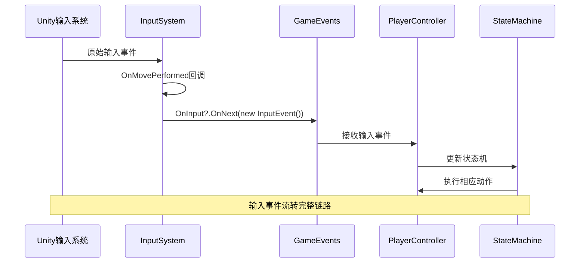
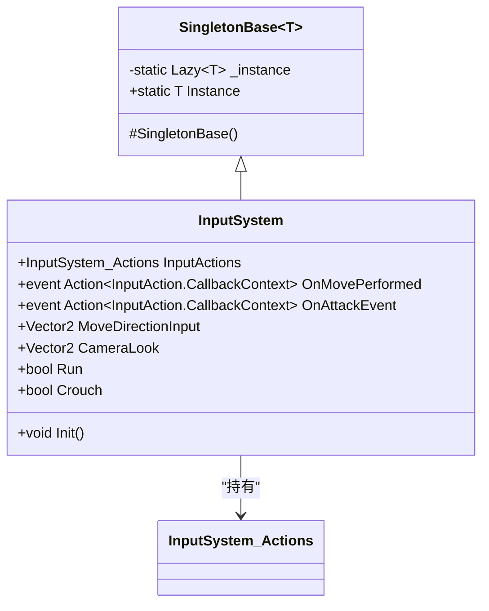
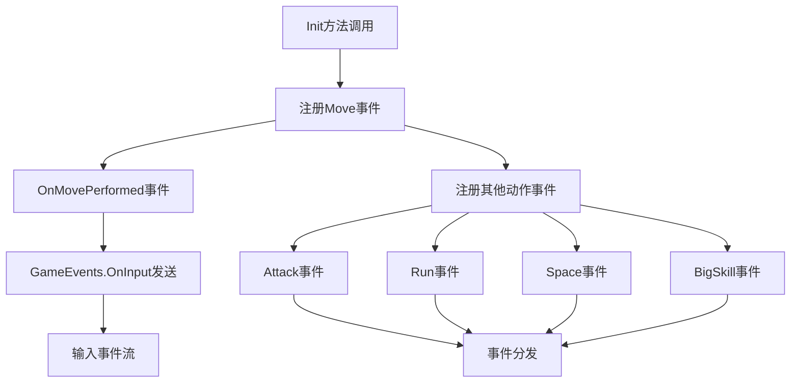
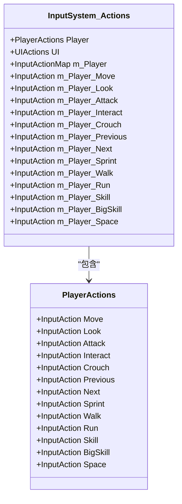
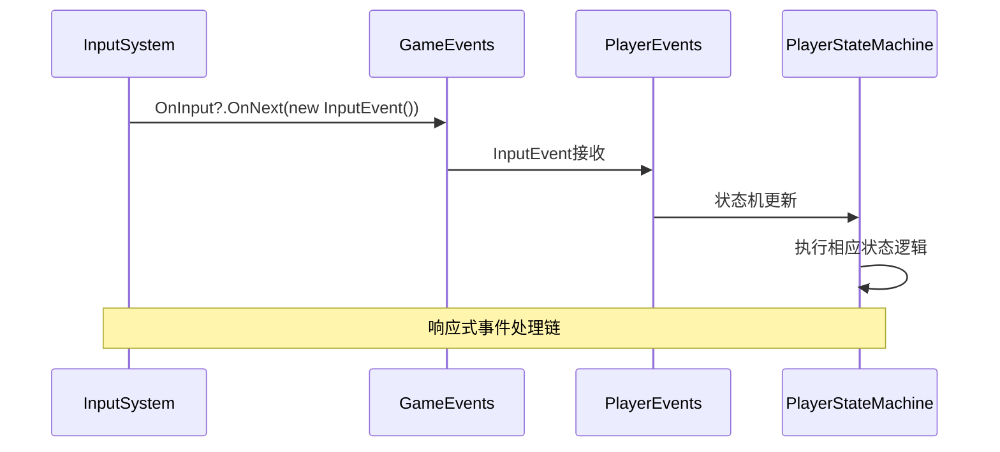
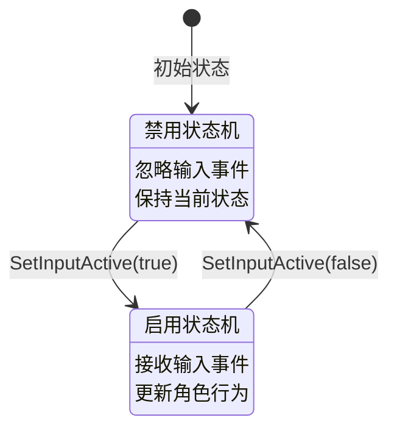
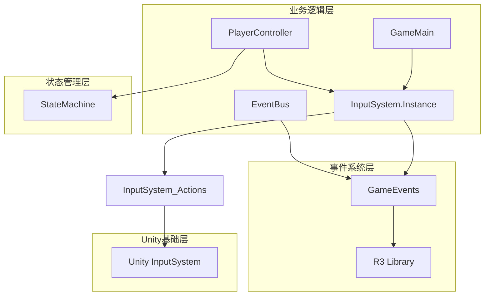

# 输入管理器

<cite>
**本文档中引用的文件**
- [InputSystem.cs](file://Assets/Scripts/Manager/InputSystem/InputSystem.cs)
- [Singleton.cs](file://Assets/Scripts/Tool/Singleton.cs)
- [InputSystem_Actions.cs](file://Assets/InputSystem_Actions.cs)
- [GameMain.cs](file://Assets/Scripts/Manager/GameMain.cs)
- [GameEvents.cs](file://Assets/Scripts/Manager/EventSystem/GameEvents.cs)
- [PlayerController.cs](file://Assets/Scripts/Controller/PlayerController.cs)
- [PlayerEvents.cs](file://Assets/Scripts/EventData/PlayerEvents.cs)
</cite>

## 目录
1. [简介](#简介)
2. [项目结构](#项目结构)
3. [核心组件](#核心组件)
4. [架构概览](#架构概览)
5. [详细组件分析](#详细组件分析)
6. [依赖关系分析](#依赖关系分析)
7. [性能考虑](#性能考虑)
8. [故障排除指南](#故障排除指南)
9. [结论](#结论)

## 简介

输入管理系统是Unity游戏引擎中负责处理玩家输入的核心模块。该系统采用单例模式设计，集成了Unity的新输入系统（New Input System），提供了统一的输入事件管理和游戏事件流转换功能。系统通过InputSystem单例类作为中央控制器，管理所有输入动作的注册、回调和事件分发。

## 项目结构

输入管理系统的文件组织结构清晰，主要包含以下关键目录：

```mermaid
graph TB
subgraph "输入系统核心"
A[InputSystem.cs] --> B[SingletonBase继承]
A --> C[InputActions属性]
A --> D[Init初始化方法]
end
subgraph "输入动作定义"
E[InputSystem_Actions.cs] --> F[Player动作映射]
E --> G[UI动作映射]
E --> H[控制方案]
end
subgraph "事件系统"
I[GameEvents.cs] --> J[Subject<InputEvent>>
K[EventBus.cs] --> L[GameEvent泛型]
end
subgraph "控制器"
M[PlayerController.cs] --> N[SetInputActive方法]
O[GameMain.cs] --> P[初始化流程]
end
A --> E
A --> I
M --> A
O --> A
```

**图表来源**
- [InputSystem.cs](file://Assets/Scripts/Manager/InputSystem/InputSystem.cs#L1-L94)
- [InputSystem_Actions.cs](file://Assets/InputSystem_Actions.cs#L1-L50)
- [GameEvents.cs](file://Assets/Scripts/Manager/EventSystem/GameEvents.cs#L1-L24)

## 核心组件

### InputSystem单例类

InputSystem类是整个输入管理系统的核心，继承自SingletonBase基类，确保全局唯一性。该类的主要职责包括：

- **单例生命周期管理**：通过SingletonBase基类实现线程安全的单例模式
- **输入动作持有**：维护InputSystem_Actions实例的引用
- **回调系统建立**：初始化输入事件的回调注册
- **输入读取封装**：提供高层次的输入属性访问接口

### InputActions属性

InputActions属性持有InputSystem_Actions实例，这是Unity新输入系统的核心组件。它包含了：
- Player动作映射（移动、攻击、交互等）
- UI动作映射（导航、提交、取消等）
- 多种控制方案支持（键盘鼠标、手柄、触摸等）

### 事件系统集成

输入系统与游戏事件系统紧密集成，通过GameEvents.OnInput将原始输入转换为标准化的游戏事件流。

**章节来源**
- [InputSystem.cs](file://Assets/Scripts/Manager/InputSystem/InputSystem.cs#L1-L94)
- [Singleton.cs](file://Assets/Scripts/Tool/Singleton.cs#L1-L24)

## 架构概览

输入管理系统采用分层架构设计，从底层的Unity输入系统到高层的游戏事件系统形成完整的输入处理链路：



**图表来源**
- [InputSystem.cs](file://Assets/Scripts/Manager/InputSystem/InputSystem.cs#L50-L70)
- [GameEvents.cs](file://Assets/Scripts/Manager/EventSystem/GameEvents.cs#L15-L16)

## 详细组件分析

### InputSystem单例类深度分析

#### 单例模式实现

InputSystem继承自SingletonBase基类，使用Lazy<T>实现线程安全的延迟初始化：



**图表来源**
- [Singleton.cs](file://Assets/Scripts/Tool/Singleton.cs#L8-L23)
- [InputSystem.cs](file://Assets/Scripts/Manager/InputSystem/InputSystem.cs#L5-L94)

#### Init()方法回调系统

Init()方法建立了关键的输入回调系统，为每个输入动作注册相应的事件处理器：



**图表来源**
- [InputSystem.cs](file://Assets/Scripts/Manager/InputSystem/InputSystem.cs#L50-L70)

#### 输入属性封装

InputSystem提供了多个只读属性来封装输入读取逻辑：

| 属性名 | 类型 | 功能描述 | 使用场景 |
|--------|------|----------|----------|
| MoveDirectionInput | Vector2 | 获取移动方向输入 | 角色移动控制 |
| CameraLook | Vector2 | 获取相机视角输入 | 摄像机旋转 |
| Run | bool | 获取跑步触发状态 | 跑步动作判断 |
| Crouch | bool | 获取蹲下触发状态 | 蹲下动作判断 |
| Walk | bool | 获取步行触发状态 | 步行动作判断 |
| Space | bool | 获取空格键触发状态 | 角色切换 |

**章节来源**
- [InputSystem.cs](file://Assets/Scripts/Manager/InputSystem/InputSystem.cs#L72-L94)

### InputSystem_Actions深入解析

InputSystem_Actions是Unity新输入系统自动生成的代码，提供了完整的输入动作定义：

#### Player动作映射

Player动作映射包含游戏核心交互的所有输入动作：



**图表来源**
- [InputSystem_Actions.cs](file://Assets/InputSystem_Actions.cs#L1302-L1409)

#### 控制方案支持

系统支持多种输入设备和控制方案：

| 控制方案 | 设备类型 | 主要按键 | 应用场景 |
|----------|----------|----------|----------|
| Keyboard&Mouse | 键盘+鼠标 | WASD, 鼠标移动 | PC端游戏 |
| Gamepad | 游戏手柄 | 左摇杆, A/B按钮 | 主机游戏 |
| Joystick | 万向摇杆 | 摇杆, 按钮 | 专业控制 |
| XR | VR控制器 | 触控板, 摇杆 | 虚拟现实 |

**章节来源**
- [InputSystem_Actions.cs](file://Assets/InputSystem_Actions.cs#L1727-L1791)

### 事件系统集成分析

#### GameEvents输入事件流

GameEvents提供了标准化的输入事件流，通过R3库的Subject实现响应式编程：



**图表来源**
- [GameEvents.cs](file://Assets/Scripts/Manager/EventSystem/GameEvents.cs#L15-L16)

#### PlayerController输入激活机制

PlayerController实现了灵活的输入激活控制：



**图表来源**
- [PlayerController.cs](file://Assets/Scripts/Controller/PlayerController.cs#L75-L93)

**章节来源**
- [GameEvents.cs](file://Assets/Scripts/Manager/EventSystem/GameEvents.cs#L1-L24)
- [PlayerController.cs](file://Assets/Scripts/Controller/PlayerController.cs#L75-L93)

## 依赖关系分析

输入管理系统的依赖关系形成了清晰的层次结构：



**图表来源**
- [GameMain.cs](file://Assets/Scripts/Manager/GameMain.cs#L15-L18)
- [InputSystem.cs](file://Assets/Scripts/Manager/InputSystem/InputSystem.cs#L1-L94)

**章节来源**
- [GameMain.cs](file://Assets/Scripts/Manager/GameMain.cs#L1-L74)

## 性能考虑

输入管理系统在设计时充分考虑了性能优化：

### 单例模式优势
- 避免重复创建输入系统实例
- 减少内存占用和初始化开销
- 提供全局统一的输入访问点

### 延迟初始化策略
- 使用Lazy<T>实现按需初始化
- 避免不必要的资源分配
- 支持多线程环境下的安全访问

### 事件驱动架构
- 采用响应式编程模式
- 减少轮询和频繁的状态检查
- 提高系统的响应性和可扩展性

## 故障排除指南

### 常见问题及解决方案

#### 输入无响应问题
1. **检查InputActions是否正确初始化**
   - 确认InputSystem.Instance.InputActions不为null
   - 验证InputActions.Enable()方法被调用

2. **验证回调注册是否成功**
   - 检查Init()方法是否被执行
   - 确认事件处理器正确绑定

3. **调试输入读取**
   - 使用Debug.Log输出MoveDirectionInput值
   - 检查输入设备连接状态

#### 事件流异常问题
1. **GameEvents.OnInput为空**
   - 确认GameEvents静态构造完成
   - 检查订阅者是否正确添加

2. **状态机更新失败**
   - 验证PlayerController的SetInputActive方法
   - 检查状态机的Enable/Disable逻辑

**章节来源**
- [InputSystem.cs](file://Assets/Scripts/Manager/InputSystem/InputSystem.cs#L10-L20)
- [GameMain.cs](file://Assets/Scripts/Manager/GameMain.cs#L15-L18)

## 结论

输入管理系统通过精心设计的架构实现了高效、可扩展的输入处理能力。系统采用单例模式确保全局唯一性，集成Unity新输入系统提供丰富的输入支持，并通过事件驱动架构实现松耦合的设计。这种设计不仅提高了开发效率，还为未来的功能扩展奠定了坚实的基础。

系统的模块化设计使得各个组件职责明确，便于维护和测试。同时，响应式编程的应用使事件处理更加优雅和高效。对于游戏开发者而言，这套输入管理系统提供了一个可靠、易用的输入处理解决方案。