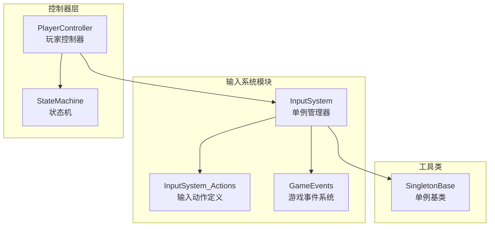
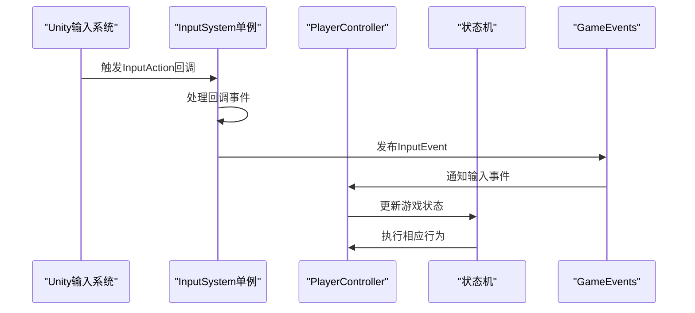
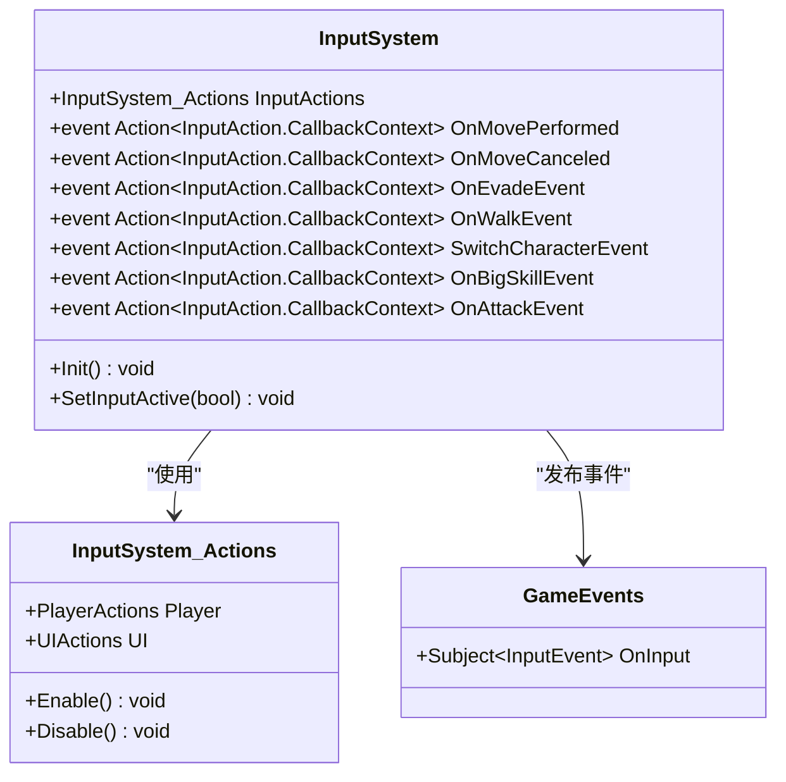
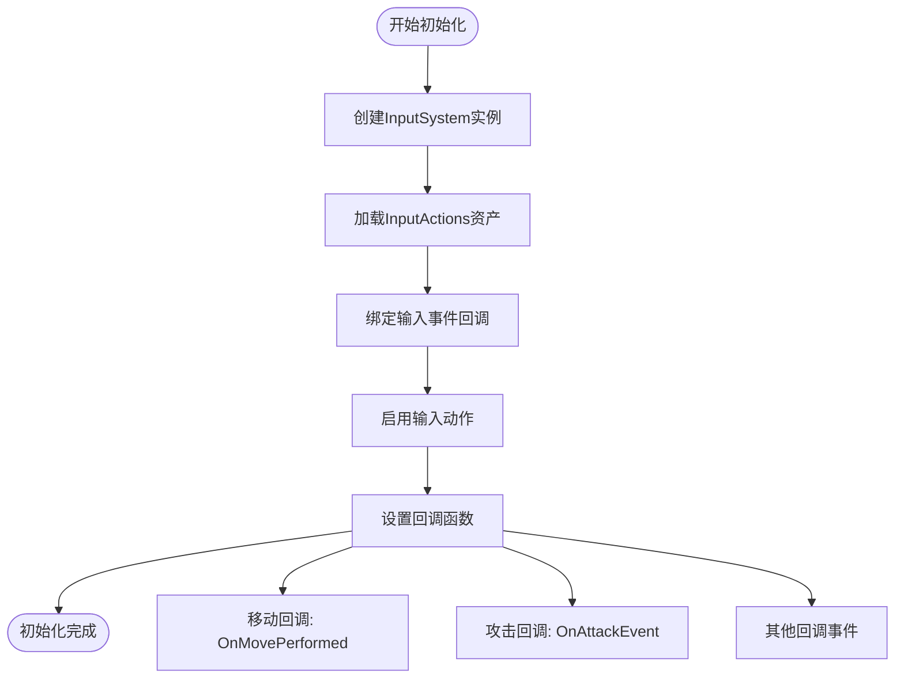
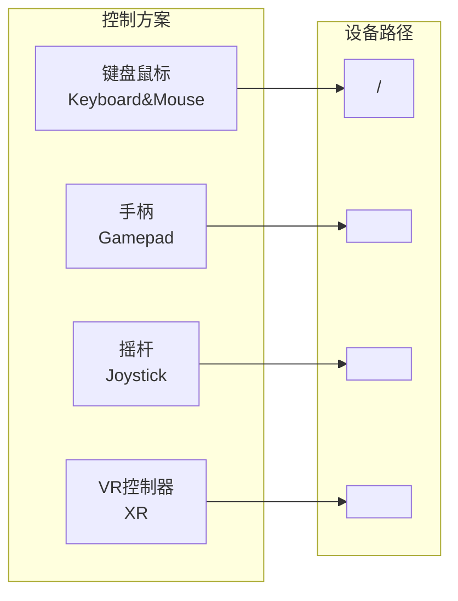
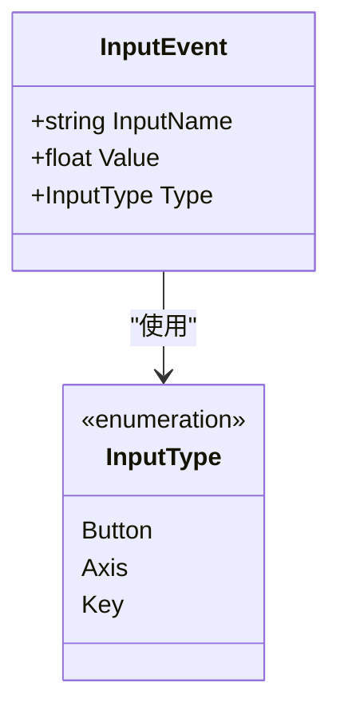
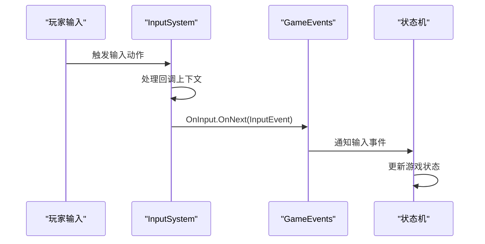
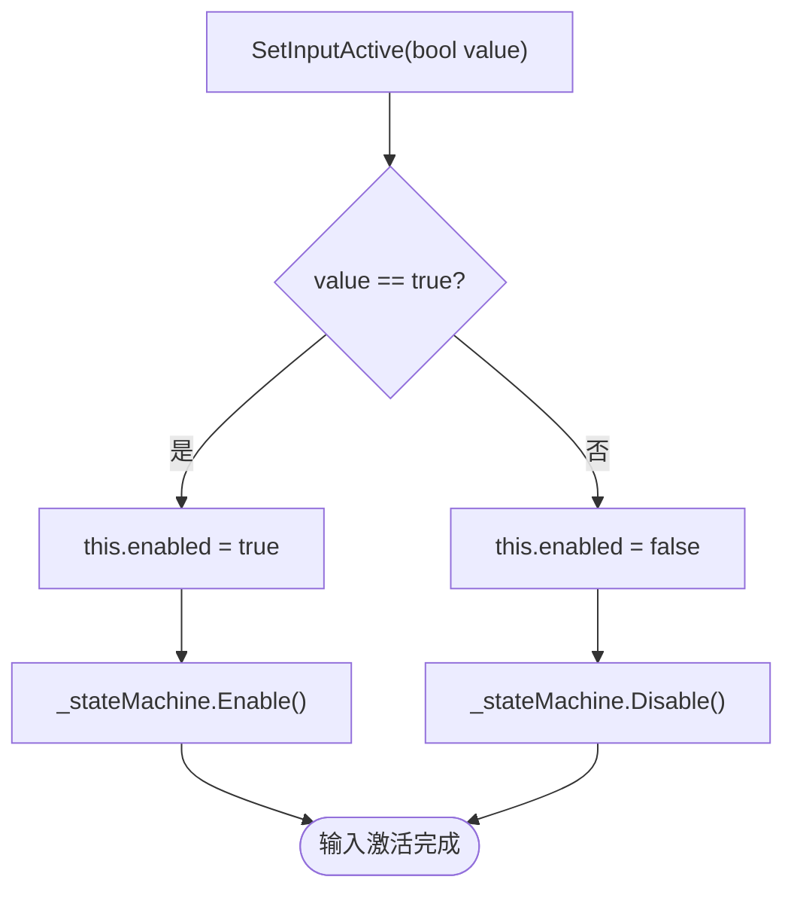
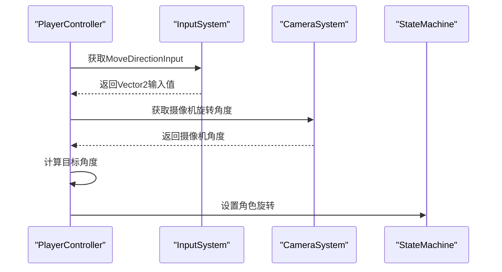
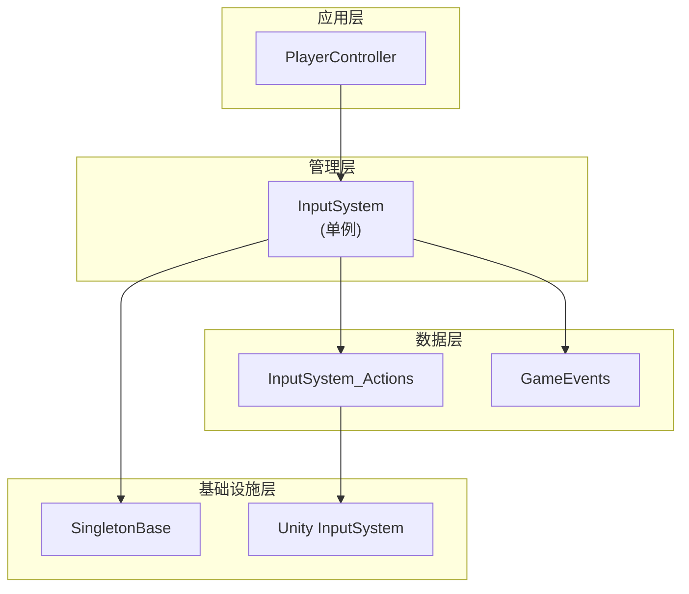

# 输入系统

<cite>
**本文档中引用的文件**
- [InputSystem.cs](file://Assets/Scripts/Manager/InputSystem/InputSystem.cs)
- [InputSystem_Actions.cs](file://Assets/InputSystem_Actions.cs)
- [GameEvents.cs](file://Assets/Scripts/Manager/EventSystem/GameEvents.cs)
- [EventLists.cs](file://Assets/Scripts/Manager/EventSystem/EventLists.cs)
- [PlayerController.cs](file://Assets/Scripts/Controller/PlayerController.cs)
- [Singleton.cs](file://Assets/Scripts/Tool/Singleton.cs)
</cite>

## 目录
1. [简介](#简介)
2. [项目结构](#项目结构)
3. [核心组件](#核心组件)
4. [架构概览](#架构概览)
5. [详细组件分析](#详细组件分析)
6. [依赖关系分析](#依赖关系分析)
7. [性能考虑](#性能考虑)
8. [故障排除指南](#故障排除指南)
9. [结论](#结论)

## 简介

本输入系统是一个基于Unity新输入系统的完整解决方案，采用单例模式设计，提供了统一的输入管理接口。该系统集成了Unity的InputSystem包，支持多种输入设备（键盘鼠标、手柄、VR控制器等），并通过事件驱动的方式将原始输入转换为游戏事件。

系统的核心特点包括：
- 基于Unity新输入系统的单例管理模式
- 完整的输入事件回调机制
- 多平台输入设备支持
- 事件驱动的游戏状态管理
- 灵活的输入映射配置

## 项目结构

输入系统在项目中的组织结构如下：

**图表来源**
- [InputSystem.cs](file://Assets/Scripts/Manager/InputSystem/InputSystem.cs#L1-L94)
- [InputSystem_Actions.cs](file://Assets/InputSystem_Actions.cs#L1-L50)
- [Singleton.cs](file://Assets/Scripts/Tool/Singleton.cs#L1-L23)

**章节来源**
- [InputSystem.cs](file://Assets/Scripts/Manager/InputSystem/InputSystem.cs#L1-L94)
- [InputSystem_Actions.cs](file://Assets/InputSystem_Actions.cs#L1-L100)

## 核心组件

### InputSystem 单例管理器

InputSystem是整个输入系统的核心管理器，继承自SingletonBase基类，负责协调所有输入相关的操作。

主要功能：
- 管理InputActions资产的生命周期
- 提供输入事件的注册和触发机制
- 封装输入读取逻辑为只读属性
- 集成Unity新输入系统的回调事件

### InputActions 资产定义

InputSystem_Actions是通过Unity输入系统代码生成器自动生成的类，包含了所有预定义的输入动作和绑定配置。

包含两个主要的动作映射：
- **Player动作映射**：包含移动、攻击、交互等玩家控制相关动作
- **UI动作映射**：包含导航、提交、取消等UI交互动作

### GameEvents 事件系统

GameEvents提供了统一的游戏事件发布机制，输入系统通过此系统将原始输入事件转换为游戏事件。

**章节来源**
- [InputSystem.cs](file://Assets/Scripts/Manager/InputSystem/InputSystem.cs#L5-L94)
- [InputSystem_Actions.cs](file://Assets/InputSystem_Actions.cs#L1532-L1564)
- [GameEvents.cs](file://Assets/Scripts/Manager/EventSystem/GameEvents.cs#L1-L24)

## 架构概览

输入系统采用分层架构设计，从底层的Unity输入系统到高层的游戏逻辑形成清晰的层次结构：

**图表来源**
- [InputSystem.cs](file://Assets/Scripts/Manager/InputSystem/InputSystem.cs#L50-L70)
- [GameEvents.cs](file://Assets/Scripts/Manager/EventSystem/GameEvents.cs#L18-L20)

## 详细组件分析

### InputSystem 单例实现

InputSystem类实现了完整的输入系统管理功能：

#### 事件回调定义

系统定义了多个输入事件回调，每个回调对应特定的输入动作：

**图表来源**
- [InputSystem.cs](file://Assets/Scripts/Manager/InputSystem/InputSystem.cs#L25-L45)
- [InputSystem_Actions.cs](file://Assets/InputSystem_Actions.cs#L1532-L1564)

#### 只读属性封装

InputSystem提供了多个只读属性来封装输入读取逻辑：

| 属性名称 | 类型 | 描述 | 触发条件 |
|---------|------|------|----------|
| MoveDirectionInput | Vector2 | 移动方向输入 | 当玩家移动时更新 |
| CameraLook | Vector2 | 相机视角输入 | 当玩家旋转视角时更新 |
| Run | bool | 冲刺按键状态 | 按下冲刺键时为true |
| Crouch | bool | 蹲下按键状态 | 按下蹲键时为true |
| Walk | bool | 行走按键状态 | 按下行走键时为true |
| Space | bool | 空格按键状态 | 按下空格键时为true |

#### 初始化流程

InputSystem的初始化过程包括事件绑定和系统启用：

**图表来源**
- [InputSystem.cs](file://Assets/Scripts/Manager/InputSystem/InputSystem.cs#L50-L70)

**章节来源**
- [InputSystem.cs](file://Assets/Scripts/Manager/InputSystem/InputSystem.cs#L50-L94)

### InputActions 动作映射配置

InputSystem_Actions类包含了完整的输入动作定义和绑定配置：

#### Player动作映射

Player动作映射包含以下核心动作：

| 动作名称 | 类型 | 预期控制类型 | 主要用途 |
|---------|------|-------------|----------|
| Move | Value | Vector2 | 玩家移动控制 |
| Look | Value | Vector2 | 相机视角控制 |
| Attack | Button | Button | 普通攻击 |
| Interact | Button | Button | 交互动作（长按） |
| Crouch | Button | Button | 蹲下动作 |
| Sprint | Button | Button | 冲刺动作 |
| Walk | Button | Button | 行走模式切换 |
| Run | Button | Button | 快速移动 |
| Skill | Button | Button | 普通技能 |
| BigSkill | Button | Button | 大招技能 |
| Space | Button | Button | 角色切换 |

#### 控制方案支持

系统支持多种控制方案，每种方案针对不同的输入设备优化：

**图表来源**
- [InputSystem_Actions.cs](file://Assets/InputSystem_Actions.cs#L1178-L1211)

**章节来源**
- [InputSystem_Actions.cs](file://Assets/InputSystem_Actions.cs#L1302-L1389)

### 事件系统集成

输入系统与GameEvents紧密集成，形成了完整的事件驱动架构：

#### InputEvent 结构

InputEvent是输入系统发布的标准事件结构：

**图表来源**
- [EventLists.cs](file://Assets/Scripts/Manager/EventSystem/EventLists.cs#L45-L55)

#### 事件发布流程

当输入系统检测到用户输入时，会按照以下流程发布事件：

**图表来源**
- [InputSystem.cs](file://Assets/Scripts/Manager/InputSystem/InputSystem.cs#L55-L60)
- [GameEvents.cs](file://Assets/Scripts/Manager/EventSystem/GameEvents.cs#L18-L20)

**章节来源**
- [EventLists.cs](file://Assets/Scripts/Manager/EventSystem/EventLists.cs#L45-L55)
- [GameEvents.cs](file://Assets/Scripts/Manager/EventSystem/GameEvents.cs#L18-L20)

### PlayerController 输入处理

PlayerController展示了如何在实际游戏中使用输入系统：

#### 输入激活管理

PlayerController提供了统一的输入激活管理方法：

**图表来源**
- [PlayerController.cs](file://Assets/Scripts/Controller/PlayerController.cs#L75-L93)

#### 移动方向处理

PlayerController使用InputSystem提供的MoveDirectionInput属性来计算角色移动：

**图表来源**
- [PlayerController.cs](file://Assets/Scripts/Controller/PlayerController.cs#L50-L65)

**章节来源**
- [PlayerController.cs](file://Assets/Scripts/Controller/PlayerController.cs#L50-L93)

## 依赖关系分析

输入系统的依赖关系展现了清晰的分层架构：

**图表来源**
- [InputSystem.cs](file://Assets/Scripts/Manager/InputSystem/InputSystem.cs#L1-L5)
- [Singleton.cs](file://Assets/Scripts/Tool/Singleton.cs#L1-L23)

### 关键依赖说明

1. **Unity InputSystem包**：作为底层输入系统基础
2. **R3响应式编程库**：用于事件系统的响应式编程
3. **SingletonBase基类**：提供线程安全的单例实现
4. **Unity引擎核心**：提供基础的输入和游戏对象功能

**章节来源**
- [InputSystem.cs](file://Assets/Scripts/Manager/InputSystem/InputSystem.cs#L1-L5)
- [Singleton.cs](file://Assets/Scripts/Tool/Singleton.cs#L1-L23)

## 性能考虑

输入系统在设计时充分考虑了性能优化：

### 单例模式优势

- **内存效率**：单例模式确保只有一个输入系统实例存在
- **访问速度**：通过静态属性快速访问输入系统
- **资源管理**：统一管理输入系统的生命周期

### 事件驱动优化

- **延迟执行**：事件采用延迟执行模式，避免阻塞主循环
- **条件触发**：只有在需要时才触发相应的事件处理
- **批量处理**：同一帧内的多个输入事件可以批量处理

### 内存管理

- **自动垃圾回收**：利用Unity的对象池和垃圾回收机制
- **及时释放**：在对象销毁时及时释放输入系统资源
- **弱引用**：避免循环引用导致的内存泄漏

## 故障排除指南

### 常见问题及解决方案

#### 输入无响应

**问题描述**：玩家输入无法被系统识别

**可能原因**：
1. InputSystem未正确初始化
2. 输入动作未启用
3. 控制方案不匹配

**解决方案**：
1. 检查InputSystem.Instance是否正确创建
2. 确认InputActions.Player.Enable()被调用
3. 验证当前使用的控制方案是否正确

#### 事件未触发

**问题描述**：输入事件没有正确触发回调

**可能原因**：
1. 事件订阅者未正确注册
2. 输入动作绑定错误
3. 事件发布失败

**解决方案**：
1. 检查事件订阅代码
2. 验证InputSystem_Actions中的绑定配置
3. 添加调试日志确认事件发布

#### 性能问题

**问题描述**：输入响应延迟或卡顿

**可能原因**：
1. 过多的事件订阅
2. 复杂的事件处理逻辑
3. 不当的输入轮询频率

**解决方案**：
1. 减少不必要的事件订阅
2. 优化事件处理逻辑
3. 使用适当的更新频率

**章节来源**
- [InputSystem.cs](file://Assets/Scripts/Manager/InputSystem/InputSystem.cs#L50-L70)
- [InputSystem_Actions.cs](file://Assets/InputSystem_Actions.cs#L1229-L1267)

## 结论

本输入系统提供了一个完整、可扩展的Unity输入解决方案。通过单例模式的使用，确保了系统的统一性和高效性；通过事件驱动的设计，实现了输入与游戏逻辑的解耦；通过多平台支持，提供了灵活的输入体验。

### 主要优势

1. **架构清晰**：分层设计使得系统易于理解和维护
2. **扩展性强**：支持添加新的输入动作和控制方案
3. **性能优秀**：单例模式和事件驱动确保了良好的性能表现
4. **兼容性好**：支持多种输入设备和控制方案

### 最佳实践建议

1. **合理使用单例**：确保InputSystem的正确初始化和生命周期管理
2. **事件订阅管理**：及时取消不需要的事件订阅以避免内存泄漏
3. **输入验证**：在处理输入时进行适当的验证和边界检查
4. **性能监控**：定期监控输入系统的性能表现，及时优化

该输入系统为Unity游戏开发提供了一个坚实的基础，能够满足大多数游戏的输入需求，并为未来的功能扩展提供了良好的架构支持。