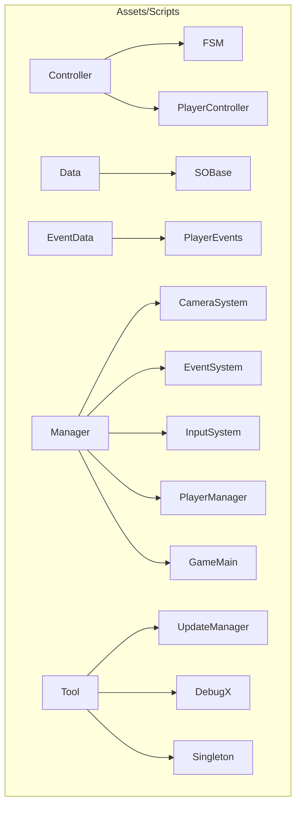
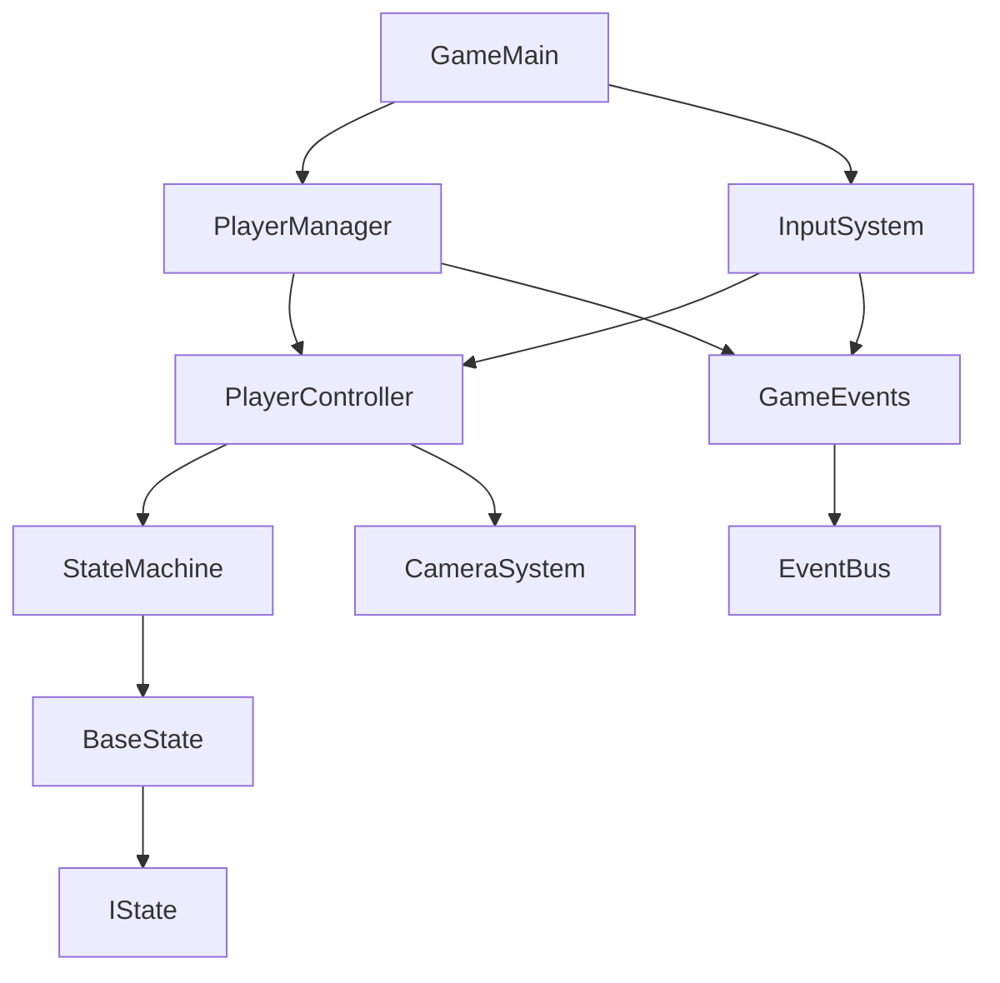
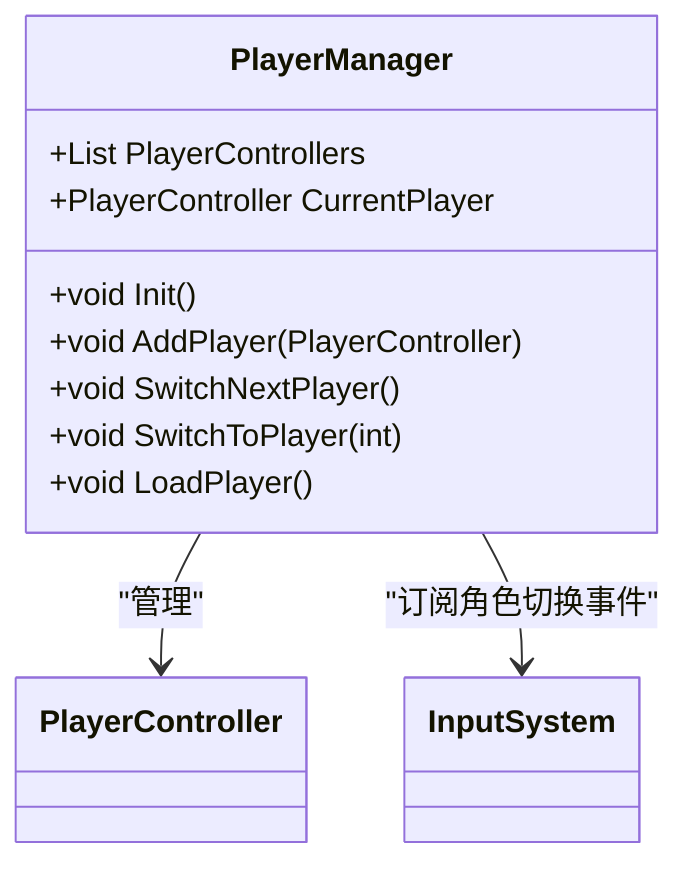
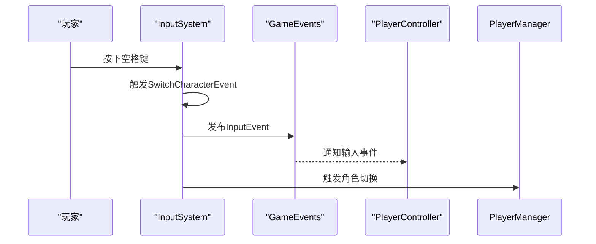
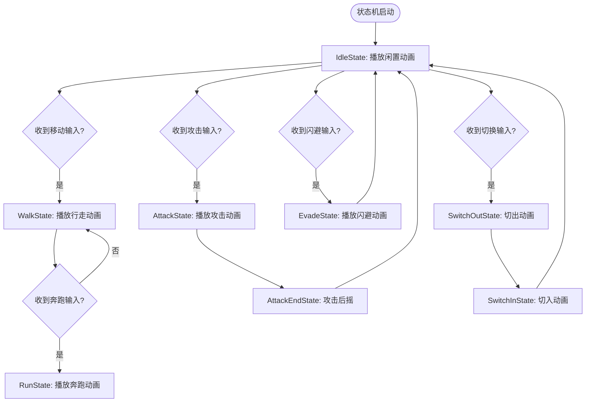
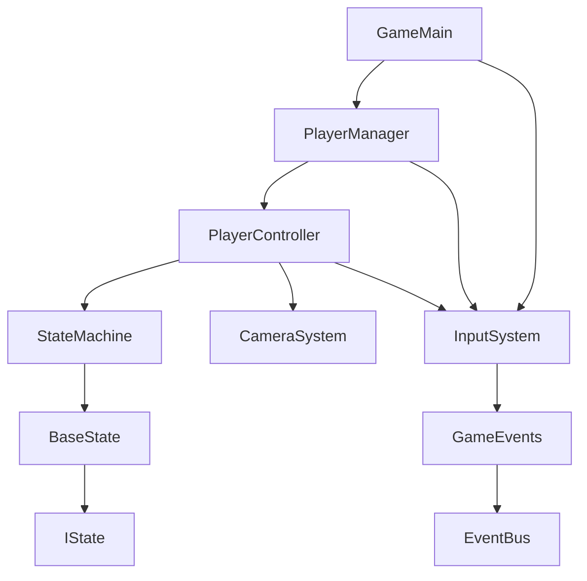

# 项目概述

<cite>
**本文档引用的文件**
- [GameMain.cs](file://Assets/Scripts/Manager/GameMain.cs)
- [PlayerManager.cs](file://Assets/Scripts/Manager/PlayerManager/PlayerManager.cs)
- [InputSystem.cs](file://Assets/Scripts/Manager/InputSystem/InputSystem.cs)
- [PlayerController.cs](file://Assets/Scripts/Controller/PlayerController.cs)
- [StateMachine.cs](file://Assets/Scripts/Controller/FSM/StateMachine.cs)
- [BaseState.cs](file://Assets/Scripts/Controller/FSM/BaseState.cs)
- [IState.cs](file://Assets/Scripts/Controller/FSM/IState.cs)
- [EventBus.cs](file://Assets/Scripts/Manager/EventSystem/EventBus.cs)
- [GameEvents.cs](file://Assets/Scripts/Manager/EventSystem/GameEvents.cs)
- [TeamInfo.cs](file://Assets/Scripts/Data/SOBase/TeamInfo.cs)
- [PlayerInfo.cs](file://Assets/Scripts/Data/SOBase/PlayerInfo.cs)
- [Singleton.cs](file://Assets/Scripts/Tool/Singleton.cs)
- [技术文档.md](file://Assets/Scripts/技术文档.md)
</cite>

## 目录
1. [简介](#简介)
2. [项目结构](#项目结构)
3. [核心组件](#核心组件)
4. [架构概述](#架构概述)
5. [详细组件分析](#详细组件分析)
6. [依赖分析](#依赖分析)
7. [性能考虑](#性能考虑)
8. [故障排除指南](#故障排除指南)
9. [结论](#结论)

## 简介
ZZZ项目是一个基于Unity引擎的3D动作游戏项目，其核心是多角色切换控制系统。该项目采用现代化的架构设计，结合了状态机系统、玩家管理系统、事件系统和输入系统，实现了流畅的角色控制和切换机制。项目使用R3响应式编程处理事件，确保了系统的响应性和可维护性。通过GameMain作为游戏入口点，系统能够正确初始化PlayerManager、InputSystem并加载角色。本项目为初学者提供了高层次的理解，同时为有经验的开发者提供了深入的技术细节。

## 项目结构
ZZZ项目遵循清晰的文件组织结构，将代码按功能模块进行划分。项目主要分为Controller（控制器）、Data（数据）、EventData（事件数据）、Manager（管理器）和Tool（工具）等目录，每个目录都有明确的职责。这种结构化的组织方式使得代码易于维护和扩展。

**Diagram sources**
- [技术文档.md](file://Assets/Scripts/技术文档.md)

**Section sources**
- [技术文档.md](file://Assets/Scripts/技术文档.md)

## 核心组件
ZZZ项目的核心组件包括PlayerManager、InputSystem、StateMachine和GameMain。PlayerManager负责管理多个玩家角色的切换和生命周期，通过单例模式确保全局唯一实例。InputSystem连接Unity的新输入系统，处理玩家的各种输入事件。StateMachine实现了一个基于状态模式的角色控制系统，管理角色的各种状态（如闲置、行走、攻击等）。GameMain作为游戏的入口点，在Awake阶段初始化各个管理系统并加载角色。

**Section sources**
- [GameMain.cs](file://Assets/Scripts/Manager/GameMain.cs#L1-L74)
- [PlayerManager.cs](file://Assets/Scripts/Manager/PlayerManager/PlayerManager.cs#L1-L85)
- [InputSystem.cs](file://Assets/Scripts/Manager/InputSystem/InputSystem.cs#L1-L94)
- [PlayerController.cs](file://Assets/Scripts/Controller/PlayerController.cs#L1-L94)

## 架构概述
ZZZ项目的架构采用分层设计，各组件之间通过清晰的接口进行通信。系统以GameMain为起点，初始化PlayerManager和InputSystem。PlayerManager负责管理所有玩家角色，通过InputSystem接收输入事件，并根据当前状态调用StateMachine进行状态切换。事件系统使用R3响应式编程，实现了发布-订阅模式，使得组件间的耦合度降低。

**Diagram sources**
- [技术文档.md](file://Assets/Scripts/技术文档.md)
- [GameMain.cs](file://Assets/Scripts/Manager/GameMain.cs#L1-L74)

## 详细组件分析

### PlayerManager分析
PlayerManager是游戏的核心管理器之一，负责管理多个玩家角色的切换和生命周期。它通过单例模式实现，确保在整个游戏中只有一个实例。PlayerManager维护一个PlayerController列表和当前激活的玩家引用。当需要切换角色时，它会先禁用当前角色的状态机，然后激活新角色并将其状态机切换到SwitchInState。

**Diagram sources**
- [PlayerManager.cs](file://Assets/Scripts/Manager/PlayerManager/PlayerManager.cs#L1-L85)
- [InputSystem.cs](file://Assets/Scripts/Manager/InputSystem/InputSystem.cs#L1-L94)

### InputSystem分析
InputSystem是游戏的输入管理器，同样采用单例模式。它封装了Unity的新输入系统，将各种输入操作抽象为事件。当玩家进行移动、攻击、闪避或角色切换等操作时，InputSystem会触发相应的事件。特别的是，它使用R3响应式编程将输入事件发布到GameEvents.OnInput，实现了响应式的数据流处理。

**Diagram sources**
- [InputSystem.cs](file://Assets/Scripts/Manager/InputSystem/InputSystem.cs#L1-L94)
- [GameEvents.cs](file://Assets/Scripts/Manager/EventSystem/GameEvents.cs#L1-L24)

### StateMachine分析
StateMachine实现了状态模式，是角色行为控制的核心。它维护一个状态字典，存储所有可能的状态实例。通过ChangeState方法，可以在不同状态间安全切换。每个状态都实现了IState接口，具有OnEnter、Update和OnExit三个生命周期方法。状态机还包含状态锁定机制，防止在特定状态下被意外切换。

**Diagram sources**
- [StateMachine.cs](file://Assets/Scripts/Controller/FSM/StateMachine.cs#L1-L115)
- [BaseState.cs](file://Assets/Scripts/Controller/FSM/BaseState.cs#L1-L85)
- [IState.cs](file://Assets/Scripts/Controller/FSM/IState.cs#L1-L6)

**Section sources**
- [StateMachine.cs](file://Assets/Scripts/Controller/FSM/StateMachine.cs#L1-L115)
- [BaseState.cs](file://Assets/Scripts/Controller/FSM/BaseState.cs#L1-L85)
- [IState.cs](file://Assets/Scripts/Controller/FSM/IState.cs#L1-L6)

## 依赖分析
ZZZ项目的组件间存在清晰的依赖关系。GameMain作为入口点，直接依赖PlayerManager和InputSystem。PlayerManager依赖PlayerController和InputSystem，通过订阅角色切换事件来响应玩家操作。PlayerController依赖StateMachine来管理角色状态，同时依赖CameraSystem来获取摄像机信息。StateMachine依赖BaseState和IState接口，实现了状态模式。整个系统通过事件总线EventBus进行松耦合通信，降低了组件间的直接依赖。

**Diagram sources**
- [技术文档.md](file://Assets/Scripts/技术文档.md)
- [GameMain.cs](file://Assets/Scripts/Manager/GameMain.cs#L1-L74)

**Section sources**
- [技术文档.md](file://Assets/Scripts/技术文档.md)
- [GameMain.cs](file://Assets/Scripts/Manager/GameMain.cs#L1-L74)

## 性能考虑
ZZZ项目在设计时考虑了性能优化。首先，使用单例模式减少了不必要的对象创建和销毁开销。其次，状态机采用预注册机制，在游戏初始化时就创建所有状态实例，避免了运行时的动态创建。事件系统使用R3响应式编程，通过Subject实现了高效的事件分发。此外，PlayerController的激活/禁用机制确保了非当前角色不会消耗CPU资源。对于动画状态的检查，系统使用NormalizedTime方法进行优化，避免了频繁的GetAnimatorStateInfo调用。

## 故障排除指南
在开发和调试ZZZ项目时，可能会遇到一些常见问题。如果角色切换不工作，首先检查InputSystem中的SwitchCharacterEvent是否正确绑定到空格键。如果状态切换异常，验证StateMachine的StateLocked标志是否在适当的时候被设置。对于输入无响应的问题，确认PlayerController的SetInputActive方法是否被正确调用。如果出现内存泄漏，检查事件订阅是否在OnExit方法中被正确取消。使用DebugX工具类可以帮助快速定位问题，它提供了统一的日志输出接口。

**Section sources**
- [DebugX.cs](file://Assets/Scripts/Tool/DebugX.cs)
- [PlayerController.cs](file://Assets/Scripts/Controller/PlayerController.cs#L1-L94)
- [BaseState.cs](file://Assets/Scripts/Controller/FSM/BaseState.cs#L1-L85)

## 结论
ZZZ项目展示了一个现代化的Unity 3D动作游戏架构，其核心的多角色切换控制系统设计精良。通过状态机、事件系统和输入系统的有机结合，实现了流畅的角色控制体验。项目采用单例模式确保管理器的全局唯一性，使用R3响应式编程处理事件流，提高了系统的响应性和可维护性。GameMain作为清晰的入口点，负责初始化所有核心系统。整体架构遵循关注点分离原则，各组件职责明确，依赖关系清晰。这种设计不仅便于当前功能的实现，也为未来的功能扩展提供了良好的基础。