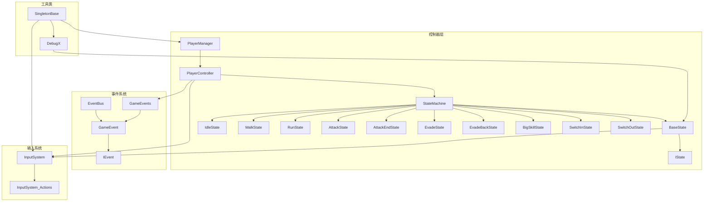

# Scripts 文件夹技术文档

## 概述

本文档详细介绍了 Unity 项目 `Assets\Scripts` 文件夹中的所有脚本组件，包括类的层级结构、功能描述、关键方法说明以及类之间的依赖关系。该代码库实现了一个基于状态机的角色控制系统，包含事件系统、输入管理和工具类等核心模块。

## 项目结构

```
Assets\Scripts\
├── Controller\           # 控制器层 - 核心游戏逻辑
│   ├── FSM\             # 状态机系统
│   │   ├── CharacterState\  # 角色状态实现
│   │   ├── BaseState.cs     # 状态基类
│   │   ├── IState.cs        # 状态接口
│   │   └── StateMachine.cs  # 状态机管理器
│   ├── CameraSystem\    # 摄像机系统
│   ├── GlobalManager.cs # 全局管理器
│   ├── PlayerController.cs # 玩家控制器
│   └── PlayerManager.cs    # 玩家管理器
├── EventSystem\         # 事件系统
│   ├── EventBus.cs      # 事件总线
│   ├── GameEvent.cs     # 游戏事件
│   ├── GameEvents.cs    # 预定义事件
│   ├── EventLists.cs    # 事件列表
│   └── IEvent.cs        # 事件接口
├── InputSystem\         # 输入系统
│   └── InputSystem.cs   # 输入管理器
└── Tool\                # 工具类
    ├── DebugX.cs        # 调试工具
    ├── Singleton.cs     # 单例模式基类
    ├── UniTaskTimer.cs  # 异步定时器
    └── UpdateManager\   # 更新管理器
```

## 核心架构

### 1. 控制器层 (Controller)

#### 1.1 玩家管理系统

**PlayerManager** (`PlayerManager.cs`)
- **功能**：管理多个玩家角色的切换和生命周期
- **继承关系**：`SingletonBase<PlayerManager>`
- **关键属性**：
  - `PlayerControllers: List<PlayerController>` - 存储所有玩家控制器
  - `CurrentPlayer: PlayerController` - 当前激活的玩家
- **关键方法**：
  - `AddPlayer(PlayerController)` - 添加玩家控制器
  - `SwitchNextPlayer()` - 切换到下一个玩家

**PlayerController** (`PlayerController.cs`)
- **功能**：单个玩家角色的核心控制器，管理角色状态、属性和行为
- **继承关系**：`MonoBehaviour`
- **关键属性**：
  - `PlayerName: PlayerName` - 玩家名称枚举
  - `MaxHealth/MaxEnergy: float` - 最大生命值/能量值
  - `_stateMachine: StateMachine` - 状态机引用
- **关键方法**：
  - `ActivatePlayer()` - 激活玩家
  - `DeactivatePlayer()` - 停用玩家
  - `TakeDamage(float)` - 承受伤害
  - `RegisterStates()` - 注册所有状态

#### 1.2 状态机系统 (FSM)

**状态机架构图**：
```
IState (接口)
    ↑
BaseState (抽象基类)
    ↑
┌─────────┬─────────┬─────────┬─────────┬─────────┬─────────┬─────────┬─────────┬─────────┬─────────┬─────────┬─────────┬─────────┐
│IdleState│WalkState│RunState │AttackState│AttackEndState│EvadeState│EvadeBackState│EvadeBackEndState│BigSkillState│SwitchInState│SwitchOutState│SkillState│JumpState│FallState│HitState│DeathState│
└─────────┴─────────┴─────────┴─────────┴─────────┴─────────┴─────────┴─────────┴─────────┴─────────┴─────────┴─────────┴─────────┘
```

**StateMachine** (`StateMachine.cs`)
- **功能**：管理和切换角色状态
- **关键属性**：
  - `_states: Dictionary<Type, IState>` - 状态字典
  - `_currentState: IState` - 当前状态
  - `StateLocked: bool` - 状态锁定标志
- **关键方法**：
  - `RegisterState<T>(T)` - 注册状态
  - `ChangeState<T>()` - 切换状态
  - `Update()` - 更新当前状态

**BaseState** (`BaseState.cs`)
- **功能**：所有状态的抽象基类，提供通用功能
- **关键方法**：
  - `OnEnter()` - 进入状态
  - `Update()` - 状态更新
  - `OnExit()` - 退出状态
  - `IsAnimationEnd()` - 检查动画是否结束
  - `NormalizedTime()` - 获取动画标准化时间

**具体状态类**：

| 状态类 | 功能描述 | 关键行为 |
|--------|----------|----------|
| `IdleState` | 闲置状态 | 监听移动、攻击、闪避、大招事件 |
| `WalkState` | 行走状态 | 4秒后自动切换到跑步状态 |
| `RunState` | 跑步状态 | 快速移动状态 |
| `AttackState` | 攻击状态 | 支持连击系统，最多4段攻击 |
| `AttackEndState` | 攻击结束状态 | 攻击后摇处理 |
| `EvadeState` | 闪避状态 | 基础闪避动作 |
| `EvadeBackState` | 后退闪避状态 | 向后闪避 |
| `EvadeBackEndState` | 后退闪避结束状态 | 闪避后摇处理 |
| `BigSkillState` | 大招状态 | 释放大招技能 |
| `SwitchInState` | 切入状态 | 角色切换进入 |
| `SwitchOutState` | 切出状态 | 角色切换退出 |

### 2. 事件系统 (EventSystem)

**事件系统架构**：

**EventBus** (`EventBus.cs`)
- **功能**：全局事件总线，管理所有游戏事件
- **关键方法**：
  - `GetGameEvent<T>()` - 获取特定类型的事件

**GameEvent<T>** (`GameEvent.cs`)
- **功能**：泛型事件类，支持订阅/发布模式
- **关键方法**：
  - `Publish(T)` - 发布事件
  - `Subscribe(Action<T>)` - 订阅事件
  - `Unsubscribe(Action<T>)` - 取消订阅

**GameEvents** (`GameEvents.cs`)
- **功能**：预定义的游戏事件集合
- **主要事件**：
  - `OnPlayerDamaged` - 玩家受伤事件
  - `OnPlayerHealed` - 玩家治疗事件
  - `OnPlayerLevelUp` - 玩家升级事件
  - `OnPlayerDeath` - 玩家死亡事件
  - `OnGameStateChanged` - 游戏状态改变事件
  - `OnInput` - 输入事件
  - `OnMouseClick` - 鼠标点击事件

### 3. 输入系统 (InputSystem)

**InputSystem** (`InputSystem.cs`)
- **功能**：管理玩家输入，连接Unity新输入系统
- **继承关系**：`SingletonBase<InputSystem>`
- **关键属性**：
  - `InputActions: InputSystem_Actions` - 输入动作资产
- **输入事件**：
  - `OnMovePerformed` - 移动输入事件
  - `OnAttackEvent` - 攻击输入事件
  - `OnEvadeEvent` - 闪避输入事件
  - `OnBigSkillEvent` - 大招输入事件
  - `SwitchCharacterEvent` - 角色切换事件

### 4. 工具类 (Tool)

**SingletonBase<T>** (`Singleton.cs`)
- **功能**：线程安全的单例模式泛型基类
- **特点**：使用 `Lazy<T>` 实现延迟初始化

**DebugX** (`DebugX.cs`)
- **功能**：调试工具类，封装Unity日志系统
- **方法**：`Log()`, `LogWarning()`, `LogError()`

**UniTaskTimer** (`UniTaskTimer.cs`)
- **功能**：基于UniTask的异步定时器
- **支持模式**：Once（一次性）、Loop（循环）
- **时间源**：Scaled（缩放时间）、Unscaled（非缩放时间）

## 类依赖关系图



## 设计模式

### 1. 状态模式 (State Pattern)
- **应用**：角色状态管理系统
- **实现**：`IState`接口 + `BaseState`基类 + 具体状态类
- **优点**：状态切换清晰，易于扩展新状态

### 2. 单例模式 (Singleton Pattern)
- **应用**：全局管理器类（PlayerManager、InputSystem、DebugX）
- **实现**：`SingletonBase<T>`泛型基类
- **优点**：确保全局唯一实例，线程安全

### 3. 观察者模式 (Observer Pattern)
- **应用**：事件系统
- **实现**：`GameEvent<T>`类的订阅/发布机制
- **优点**：解耦事件发布者和订阅者

### 4. 命令模式 (Command Pattern)
- **应用**：输入系统的事件处理
- **实现**：输入事件回调函数
- **优点**：将输入操作封装为事件

## 关键流程

### 1. 角色切换流程
1. 触发角色切换输入
2. `PlayerManager.SwitchNextPlayer()` 被调用
3. 当前玩家执行 `DeactivatePlayer()`
4. 新玩家执行 `ActivatePlayer()`
5. 状态机切换到 `SwitchInState`

### 2. 攻击流程
1. 触发攻击输入
2. `BaseState.OnAttack()` 被调用
3. 状态机切换到 `AttackState`
4. 播放攻击动画
5. 检查连击输入
6. 动画结束切换到 `AttackEndState`

### 3. 状态切换流程
1. 输入事件触发状态切换请求
2. `StateMachine.ChangeState<T>()` 被调用
3. 当前状态执行 `OnExit()`
4. 新状态执行 `OnEnter()`
5. 更新 `_currentState` 引用

## 扩展指南

### 添加新状态
1. 创建新类继承 `BaseState`
2. 实现 `OnEnter()`, `Update()`, `OnExit()` 方法
3. 在 `PlayerController.RegisterStates()` 中注册新状态
4. 在适当的事件处理中添加状态切换逻辑

### 添加新事件
1. 在 `GameEvents` 类中添加新的事件定义
2. 使用 `Subject<T>` 类型声明事件
3. 在需要的地方触发事件
4. 在订阅者中处理事件

### 添加新输入
1. 在 `InputSystem` 类中添加新的事件定义
2. 在构造函数中绑定输入动作
3. 在状态类中订阅相关输入事件

## 最佳实践

1. **状态管理**：保持状态类的单一职责，避免状态间的直接依赖
2. **事件使用**：合理使用事件系统，避免过度使用导致性能问题
3. **输入处理**：统一在 `InputSystem` 中管理输入，避免分散处理
4. **错误处理**：添加适当的错误检查和日志记录
5. **性能优化**：避免在 `Update()` 中进行昂贵的操作

## 注意事项

1. 状态机切换时确保正确清理事件订阅
2. 单例类在场景切换时需要正确处理生命周期
3. 动画状态检查需要考虑过渡状态
4. 输入事件需要在适当的时候启用/禁用
5. 角色切换时注意内存和性能影响