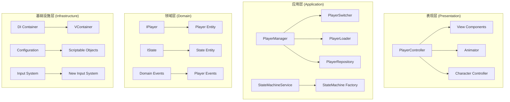

# 角色控制器生产级重构方案

## 项目概述
基于现有Unity项目架构，对角色切换、角色管理器和状态机进行全面重构，提升代码质量、可维护性和扩展性。

## 现有架构问题分析

### 1. PlayerManager 设计缺陷
- **单例模式滥用**：全局状态难以测试和维护
- **硬编码角色管理**：角色列表固定，缺乏动态配置能力
- **切换逻辑耦合**：切换逻辑与状态管理混杂
- **生命周期管理缺失**：角色创建销毁缺乏统一管理

### 2. 状态机架构问题
- **高耦合设计**：StateMachine与PlayerController紧密耦合
- **状态管理混乱**：状态切换逻辑分散在各处
- **缺乏优先级机制**：无法处理状态打断和优先级
- **动画耦合严重**：状态与动画硬编码绑定

### 3. DI容器集成不足
- **依赖注入不充分**：VContainer潜力未完全发挥
- **生命周期管理混乱**：对象创建销毁缺乏统一控制
- **配置管理缺失**：缺乏统一的配置注入机制

### 4. 输入系统问题
- **事件管理不严谨**：订阅/取消订阅容易出错
- **状态机耦合**：输入处理与状态逻辑混杂

## 重构架构设计

### 核心架构原则
1. **依赖倒置**：面向接口编程，降低耦合
2. **单一职责**：每个类只负责一个功能
3. **开闭原则**：易于扩展，避免修改
4. **依赖注入**：充分利用VContainer优势
5. **事件驱动**：解耦各模块间通信

### 新架构分层设计



## 详细重构方案

### 1. 角色管理层重构

#### 1.1 定义核心接口

```csharp
// IPlayerManager.cs - 角色管理器接口
public interface IPlayerManager
{
    IPlayer CurrentPlayer { get; }
    IReadOnlyList<IPlayer> AllPlayers { get; }
    
    void Initialize(ITeamConfig teamConfig);
    void SwitchToPlayer(int index);
    void SwitchToNextPlayer();
    void AddPlayer(IPlayer player);
    void RemovePlayer(IPlayer player);
    IPlayer GetPlayer(int index);
    bool CanSwitchPlayer();
    
    event Action<IPlayer> OnPlayerSwitched;
    event Action<IPlayer> OnPlayerAdded;
    event Action<IPlayer> OnPlayerRemoved;
}

// IPlayer.cs - 角色接口
public interface IPlayer
{
    int PlayerId { get; }
    string PlayerName { get; }
    bool IsActive { get; }
    bool CanSwitch { get; }
    
    void Activate();
    void Deactivate();
    void PrepareForSwitch();
    void CompleteSwitch();
    
    IStateMachine StateMachine { get; }
    IPlayerData Data { get; }
    GameObject GameObject { get; }
}
```

#### 1.2 实现新的PlayerManager

```csharp
// PlayerManager.cs - 重构后的角色管理器
public class PlayerManager : IPlayerManager, IDisposable
{
    private readonly IPlayerFactory _playerFactory;
    private readonly IPlayerSwitcher _playerSwitcher;
    private readonly IPlayerRepository _playerRepository;
    private readonly IEventBus _eventBus;
    
    private int _currentPlayerIndex = 0;
    private bool _isInitialized = false;
    
    public IPlayer CurrentPlayer { get; private set; }
    public IReadOnlyList<IPlayer> AllPlayers => _playerRepository.GetAllPlayers();
    
    public event Action<IPlayer> OnPlayerSwitched;
    public event Action<IPlayer> OnPlayerAdded;
    public event Action<IPlayer> OnPlayerRemoved;
    
    public PlayerManager(
        IPlayerFactory playerFactory,
        IPlayerSwitcher playerSwitcher,
        IPlayerRepository playerRepository,
        IEventBus eventBus)
    {
        _playerFactory = playerFactory;
        _playerSwitcher = playerSwitcher;
        _playerRepository = playerRepository;
        _eventBus = eventBus;
    }
    
    public void Initialize(ITeamConfig teamConfig)
    {
        if (_isInitialized) return;
        
        // 清理现有角色
        CleanupPlayers();
        
        // 创建新角色
        for (int i = 0; i < teamConfig.PlayerConfigs.Length; i++)
        {
            var playerConfig = teamConfig.PlayerConfigs[i];
            var player = _playerFactory.CreatePlayer(playerConfig, i);
            _playerRepository.AddPlayer(player);
            OnPlayerAdded?.Invoke(player);
        }
        
        // 激活第一个角色
        if (_playerRepository.PlayerCount > 0)
        {
            CurrentPlayer = _playerRepository.GetPlayer(0);
            CurrentPlayer.Activate();
        }
        
        _isInitialized = true;
        _eventBus.Publish(new PlayerManagerInitializedEvent(this));
    }
    
    public void SwitchToPlayer(int index)
    {
        if (!_isInitialized) return;
        if (index < 0 || index >= _playerRepository.PlayerCount) return;
        if (index == _currentPlayerIndex) return;
        if (!CanSwitchPlayer()) return;
        
        var targetPlayer = _playerRepository.GetPlayer(index);
        if (targetPlayer == null) return;
        
        // 执行切换
        _playerSwitcher.SwitchPlayer(CurrentPlayer, targetPlayer);
        
        // 更新当前角色
        var previousPlayer = CurrentPlayer;
        CurrentPlayer = targetPlayer;
        _currentPlayerIndex = index;
        
        // 发布事件
        OnPlayerSwitched?.Invoke(CurrentPlayer);
        _eventBus.Publish(new PlayerSwitchedEvent(previousPlayer, CurrentPlayer));
    }
    
    public bool CanSwitchPlayer()
    {
        if (CurrentPlayer == null) return false;
        return CurrentPlayer.CanSwitch && CurrentPlayer.StateMachine.CanTransition();
    }
    
    private void CleanupPlayers()
    {
        foreach (var player in _playerRepository.GetAllPlayers())
        {
            player.Deactivate();
            _playerRepository.RemovePlayer(player);
            OnPlayerRemoved?.Invoke(player);
        }
        CurrentPlayer = null;
        _currentPlayerIndex = 0;
    }
    
    public void Dispose()
    {
        CleanupPlayers();
        _isInitialized = false;
    }
}
```

### 2. 状态机系统重构

#### 2.1 状态机接口设计

```csharp
// IStateMachine.cs - 状态机接口
public interface IStateMachine
{
    IState CurrentState { get; }
    bool IsLocked { get; }
    
    void RegisterState<TState>(TState state) where TState : IState;
    void ChangeState<TState>() where TState : IState;
    void ForceChangeState<TState>() where TState : IState;
    bool CanTransition();
    
    void Update(float deltaTime);
    void FixedUpdate(float fixedDeltaTime);
    void LateUpdate();
    
    void Lock();
    void Unlock();
    
    event Action<IState> OnStateChanged;
    event Action<IState, IState> OnStateChanging;
}

// IState.cs - 状态接口
public interface IState
{
    string StateName { get; }
    int Priority { get; }
    bool CanBeInterrupted { get; }
    bool IsComplete { get; }
    
    void OnEnter(IStateMachine stateMachine);
    void OnUpdate(float deltaTime);
    void OnFixedUpdate(float fixedDeltaTime);
    void OnLateUpdate();
    void OnExit();
    
    bool CanEnter();
    bool CanExit();
}
```

#### 2.2 实现新的状态机

```csharp
// StateMachine.cs - 重构后的状态机
public class StateMachine : IStateMachine, IDisposable
{
    private readonly Dictionary<Type, IState> _states = new();
    private readonly IEventBus _eventBus;
    private readonly ILogger _logger;
    
    private IState _currentState;
    private IState _previousState;
    private bool _isLocked = false;
    private int _lockPriority = 0;
    
    public IState CurrentState => _currentState;
    public bool IsLocked => _isLocked;
    
    public event Action<IState> OnStateChanged;
    public event Action<IState, IState> OnStateChanging;
    
    public StateMachine(IEventBus eventBus, ILogger logger)
    {
        _eventBus = eventBus;
        _logger = logger;
    }
    
    public void RegisterState<TState>(TState state) where TState : IState
    {
        var stateType = typeof(TState);
        if (_states.ContainsKey(stateType))
        {
            _logger.LogWarning($"State {stateType.Name} is already registered");
            return;
        }
        
        _states[stateType] = state;
        _logger.Log($"State {stateType.Name} registered successfully");
    }
    
    public void ChangeState<TState>() where TState : IState
    {
        if (_isLocked) return;
        
        var targetStateType = typeof(TState);
        if (!_states.TryGetValue(targetStateType, out var targetState))
        {
            _logger.LogError($"State {targetStateType.Name} is not registered");
            return;
        }
        
        if (!targetState.CanEnter()) return;
        if (_currentState != null && !_currentState.CanExit()) return;
        
        PerformStateChange(targetState);
    }
    
    public void ForceChangeState<TState>() where TState : IState
    {
        var targetStateType = typeof(TState);
        if (!_states.TryGetValue(targetStateType, out var targetState))
        {
            _logger.LogError($"State {targetStateType.Name} is not registered");
            return;
        }
        
        PerformStateChange(targetState);
    }
    
    private void PerformStateChange(IState newState)
    {
        _previousState = _currentState;
        
        // 发布状态变更事件
        OnStateChanging?.Invoke(_currentState, newState);
        
        // 退出当前状态
        _currentState?.OnExit();
        
        // 进入新状态
        _currentState = newState;
        _currentState.OnEnter(this);
        
        // 发布状态已变更事件
        OnStateChanged?.Invoke(_currentState);
        
        _eventBus.Publish(new StateChangedEvent(_previousState, _currentState));
        
        _logger.Log($"State changed from {_previousState?.StateName} to {_currentState.StateName}");
    }
    
    public bool CanTransition()
    {
        if (_isLocked) return false;
        if (_currentState == null) return true;
        return _currentState.CanExit();
    }
    
    public void Update(float deltaTime)
    {
        _currentState?.OnUpdate(deltaTime);
        
        // 检查状态是否完成
        if (_currentState != null && _currentState.IsComplete)
        {
            // 自动切换到默认状态
            ChangeState<IdleState>();
        }
    }
    
    public void Lock()
    {
        _isLocked = true;
        _lockPriority = _currentState?.Priority ?? 0;
    }
    
    public void Unlock()
    {
        _isLocked = false;
        _lockPriority = 0;
    }
    
    public void Dispose()
    {
        _currentState?.OnExit();
        _states.Clear();
    }
}
```

### 3. 角色切换状态重构

#### 3.1 切换状态基类

```csharp
// PlayerSwitchState.cs - 角色切换状态基类
public abstract class PlayerSwitchState : BaseState
{
    protected IPlayer Player { get; private set; }
    protected IPlayerManager PlayerManager { get; private set; }
    protected IAnimationService AnimationService { get; private set; }
    
    public override void OnEnter(IStateMachine stateMachine)
    {
        base.OnEnter(stateMachine);
        
        // 获取必要的服务
        Player = stateMachine.GetService<IPlayer>();
        PlayerManager = stateMachine.GetService<IPlayerManager>();
        AnimationService = stateMachine.GetService<IAnimationService>();
        
        OnSwitchEnter();
    }
    
    protected abstract void OnSwitchEnter();
    protected abstract void OnSwitchUpdate(float deltaTime);
    protected abstract void OnSwitchExit();
    
    public override void OnUpdate(float deltaTime)
    {
        OnSwitchUpdate(deltaTime);
    }
    
    public override void OnExit()
    {
        OnSwitchExit();
        base.OnExit();
    }
}

// SwitchInState.cs - 切入状态
public class SwitchInState : PlayerSwitchState
{
    private bool _animationStarted = false;
    private bool _animationComplete = false;
    
    protected override void OnSwitchEnter()
    {
        // 禁用输入
        Player.SetInputActive(false);
        
        // 播放切入动画
        AnimationService.PlayAnimation("SwitchIn_Normal");
        _animationStarted = true;
        
        // 锁定状态机
        StateMachine.Lock();
    }
    
    protected override void OnSwitchUpdate(float deltaTime)
    {
        if (!_animationStarted) return;
        
        // 检查动画是否完成
        if (AnimationService.IsAnimationComplete("SwitchIn_Normal"))
        {
            _animationComplete = true;
            StateMachine.Unlock();
            StateMachine.ChangeState<IdleState>();
        }
    }
    
    protected override void OnSwitchExit()
    {
        // 启用输入
        Player.SetInputActive(true);
        
        // 通知切换完成
        Player.CompleteSwitch();
    }
    
    public override bool CanEnter() => !Player.IsActive;
    public override bool CanExit() => _animationComplete;
}
```

### 4. DI容器集成增强

#### 4.1 配置新的DI容器

```csharp
// GameLifetimeScope.cs - 游戏生命周期作用域
public class GameLifetimeScope : LifetimeScope
{
    [SerializeField] private GameConfig _gameConfig;
    [SerializeField] private TeamData _teamData;
    
    protected override void Configure(IContainerBuilder builder)
    {
        // 注册配置
        builder.RegisterInstance(_gameConfig);
        builder.RegisterInstance(_teamData);
        
        // 注册核心服务
        builder.Register<EventBus>(Lifetime.Singleton).As<IEventBus>();
        builder.Register<DebugLogger>(Lifetime.Singleton).As<ILogger>();
        
        // 注册角色管理相关
        builder.Register<PlayerFactory>(Lifetime.Singleton).As<IPlayerFactory>();
        builder.Register<PlayerRepository>(Lifetime.Singleton).As<IPlayerRepository>();
        builder.Register<PlayerSwitcher>(Lifetime.Transient).As<IPlayerSwitcher>();
        builder.Register<StateMachineFactory>(Lifetime.Singleton).As<IStateMachineFactory>();
        
        // 注册角色管理器
        builder.Register<PlayerManager>(Lifetime.Singleton).As<IPlayerManager>();
        
        // 注册输入系统
        builder.Register<InputManager>(Lifetime.Singleton).As<IInputManager>();
        
        // 注册动画服务
        builder.Register<AnimationService>(Lifetime.Transient).As<IAnimationService>();
        
        // 注册游戏主入口
        builder.RegisterEntryPoint<GameBootstrapper>();
    }
}
```

### 5. 性能优化和内存管理

#### 5.1 对象池化

```csharp
// PlayerObjectPool.cs - 角色对象池
public class PlayerObjectPool : IPlayerObjectPool
{
    private readonly Dictionary<string, Queue<GameObject>> _pools = new();
    private readonly Dictionary<GameObject, string> _activeObjects = new();
    private readonly IPlayerFactory _playerFactory;
    
    public GameObject GetPlayer(string playerId, Vector3 position, Quaternion rotation)
    {
        if (_pools.TryGetValue(playerId, out var pool) && pool.Count > 0)
        {
            var obj = pool.Dequeue();
            obj.transform.position = position;
            obj.transform.rotation = rotation;
            obj.SetActive(true);
            _activeObjects[obj] = playerId;
            return obj;
        }
        
        // 池中没有可用对象，创建新的
        return _playerFactory.CreatePlayerObject(playerId, position, rotation);
    }
    
    public void ReturnPlayer(GameObject playerObject)
    {
        if (!_activeObjects.TryGetValue(playerObject, out var playerId))
        {
            Debug.LogWarning("Trying to return object that is not from this pool");
            return;
        }
        
        _activeObjects.Remove(playerObject);
        playerObject.SetActive(false);
        
        if (!_pools.ContainsKey(playerId))
        {
            _pools[playerId] = new Queue<GameObject>();
        }
        
        _pools[playerId].Enqueue(playerObject);
    }
}
```

## 重构实施计划

### 第一阶段：核心接口和基础架构
1. 定义所有核心接口
2. 实现基础服务类
3. 配置DI容器

### 第二阶段：角色管理系统重构
1. 重构PlayerManager
2. 实现PlayerFactory和Repository
3. 优化角色生命周期管理

### 第三阶段：状态机系统重构
1. 重构StateMachine架构
2. 实现状态优先级系统
3. 优化状态切换逻辑

### 第四阶段：集成和测试
1. 集成所有模块
2. 编写单元测试
3. 性能优化和调试

## 预期收益

1. **代码质量提升**：降低耦合度，提高可维护性
2. **性能优化**：减少内存分配，提高运行效率
3. **扩展性增强**：易于添加新角色和状态
4. **测试友好**：接口化设计便于单元测试
5. **架构清晰**：分层架构，职责分明

## 风险评估和缓解措施

1. **兼容性问题**：保持现有API兼容，逐步迁移
2. **性能回归**：充分测试，确保性能不下降
3. **开发时间**：分阶段实施，降低风险
4. **团队学习成本**：提供详细文档和培训

这个重构方案将显著提升项目的架构质量和可维护性，为后续的功能扩展打下坚实基础。