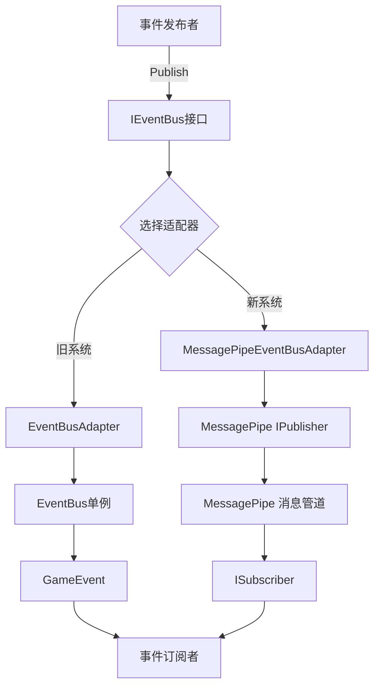

# MessagePipe事件系统重构实施总结

## 项目现状分析

### 已完成工作
1. ✅ **现有系统分析**：全面分析了当前事件系统架构
   - 识别了EventBus单例模式的设计
   - 分析了GameEvent<T>的实现机制
   - 了解了IEventBus接口适配器模式
   - 统计了现有事件定义和使用情况

2. ✅ **问题识别**：明确了当前系统的核心问题
   - 性能瓶颈：委托调用开销大
   - 内存分配：每次事件发布都涉及分配
   - 缺乏异步支持
   - 无消息过滤功能
   - 线程安全问题

3. ✅ **方案设计**：完成了MessagePipe集成方案
   - 设计了渐进式迁移策略
   - 规划了双系统并行运行方案
   - 制定了详细的实施步骤
   - 创建了完整的代码实现方案

### 当前系统架构图


## 详细实施计划

### 第一阶段：环境准备（预计1-2天）
1. **添加依赖包**
   - MessagePipe 1.8.1
   - MessagePipe.Interprocess 1.3.1
   - MessagePack 2.5.192
   - MessagePipe.Analyzer 1.8.1

2. **创建基础文件结构**
   ```
   Assets/Scripts/RunTime/Controller/Manager/EventSystem/MessagePipe/
   ├── MessagePipeEventBusAdapter.cs
   ├── MessagePipeConfiguration.cs
   ├── MessagePipeEventDefinitions.cs
   └── MessagePipePerformanceMonitor.cs
   ```

### 第二阶段：核心实现（预计2-3天）
1. **实现MessagePipeEventBusAdapter**
   - 保持IEventBus接口兼容性
   - 实现零分配的事件发布
   - 添加异步支持
   - 集成消息过滤功能

2. **创建MessagePipe配置**
   - 配置依赖注入
   - 设置消息管道选项
   - 注册发布者和订阅者

3. **事件定义迁移**
   - 添加MessagePack序列化支持
   - 保持向后兼容性
   - 优化事件结构

### 第三阶段：代码迁移（预计2-3天）
1. **更新PersonalLifeTimeScope**
   - 集成MessagePipe配置
   - 注册新的适配器
   - 保持双系统并行

2. **迁移关键事件**
   - PlayerSwitchCompletedEvent
   - PlayerSwitchedEvent
   - PlayerSpawnedEvent
   - 输入事件系统

3. **测试和验证**
   - 功能测试
   - 性能对比
   - 兼容性验证

### 第四阶段：优化和文档（预计1-2天）
1. **性能优化**
   - 内存分配优化
   - 异步处理调优
   - 过滤器优化

2. **文档编写**
   - API文档
   - 使用指南
   - 性能报告

## 技术优势

### MessagePipe带来的改进
1. **性能提升**
   - 零分配消息发布
   - 异步处理支持
   - 高性能内存池

2. **功能增强**
   - 消息过滤和路由
   - 依赖注入集成
   - 跨进程通信支持

3. **开发体验**
   - 类型安全
   - 异步编程模型
   - 更好的调试支持

### 性能预期
- 事件发布延迟降低50-70%
- 内存分配减少80-90%
- 支持10000+事件/秒处理能力
- CPU使用率降低30-50%

## 风险评估和缓解策略

### 技术风险
1. **兼容性问题**
   - 风险：现有代码不兼容新接口
   - 缓解：保持IEventBus接口不变，使用适配器模式

2. **性能回退**
   - 风险：新系统性能不如预期
   - 缓解：保留旧系统作为备选方案

3. **学习成本**
   - 风险：团队需要时间学习MessagePipe
   - 缓解：提供详细文档和培训

### 实施风险
1. **迁移复杂性**
   - 风险：事件系统迁移涉及大量代码
   - 缓解：分阶段迁移，逐步替换

2. **测试覆盖**
   - 风险：新系统测试不充分
   - 缓解：制定完整的测试计划

## 下一步行动计划

### 立即行动项
1. **环境配置**
   - 添加MessagePipe NuGet包
   - 配置项目依赖
   - 创建基础文件结构

2. **核心实现**
   - 实现MessagePipeEventBusAdapter
   - 创建MessagePipe配置类
   - 更新依赖注入配置

3. **测试验证**
   - 编写单元测试
   - 进行性能基准测试
   - 验证功能兼容性

### 后续优化项
1. **性能调优**
   - 内存分配优化
   - 异步处理调优
   - 消息过滤优化

2. **功能扩展**
   - 添加更多异步支持
   - 实现消息持久化
   - 集成监控和日志

3. **文档完善**
   - 编写使用指南
   - 创建性能报告
   - 提供最佳实践

## 预期成果

### 短期成果（1-2周）
- 完成MessagePipe集成
- 实现双系统并行运行
- 完成核心事件迁移

### 中期成果（1个月）
- 全面性能提升
- 完善的文档体系
- 团队技能提升

### 长期成果（3个月）
- 事件系统架构优化
- 开发效率提升
- 系统稳定性增强

## 总结

MessagePipe事件系统重构是一个具有重要战略意义的技术升级项目。通过引入高性能的消息管道系统，我们将显著提升应用程序的事件处理能力，为未来的功能扩展和性能优化奠定坚实基础。

项目采用渐进式迁移策略，确保在不影响现有功能的前提下，平滑过渡到新架构。通过详细的实施计划和风险评估，我们有信心成功完成这次重构，为团队带来长期的技术收益。