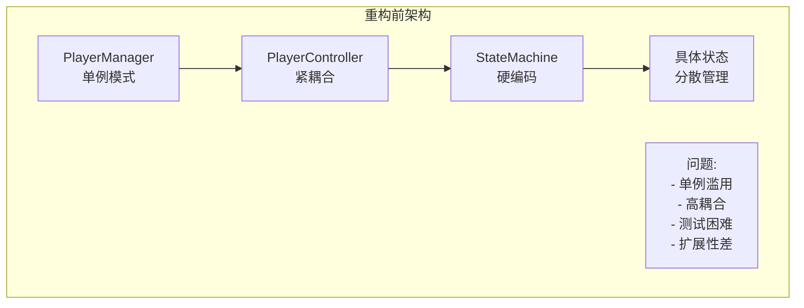
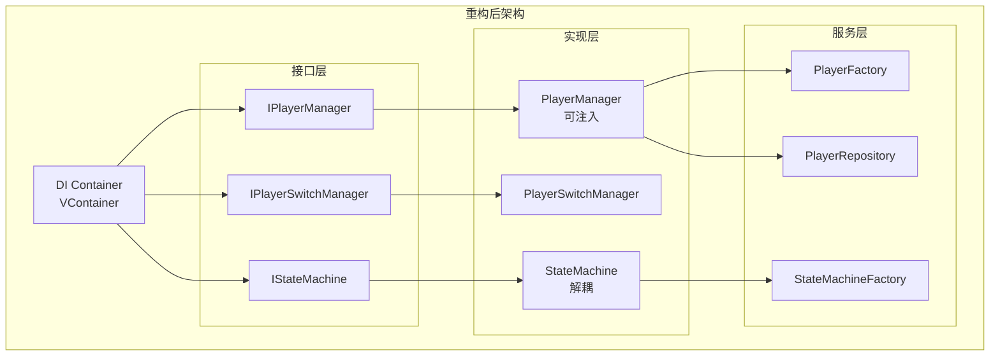
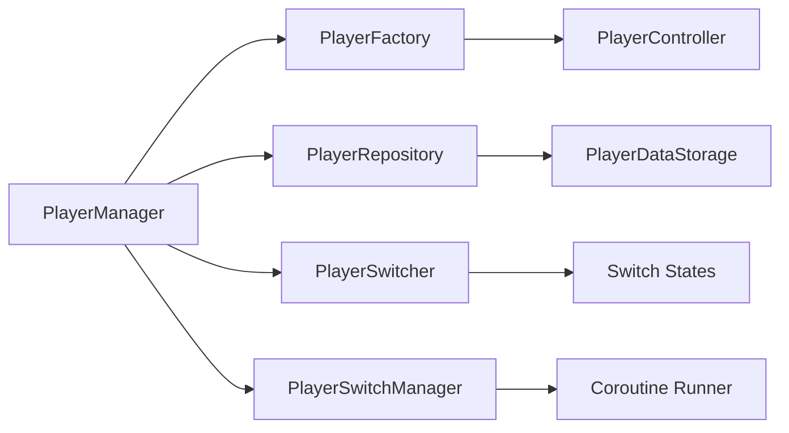
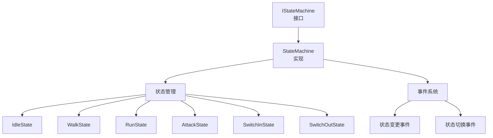
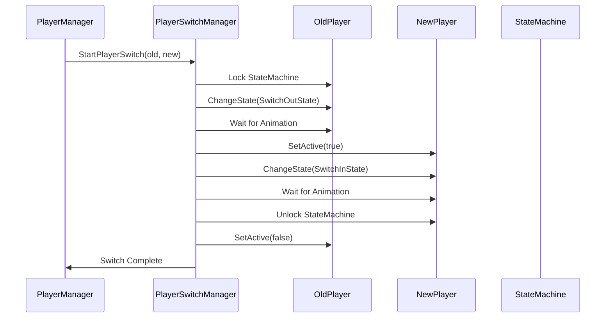

# 角色控制器重构后技术架构文档

## 概述
本文档描述了基于现有Unity项目架构进行角色切换、角色管理器和状态机重构后的新技术架构。重构目标是提升代码质量、可维护性、扩展性和性能。

## 架构演进对比

### 重构前架构问题


### 重构后架构


## 核心架构组件

### 1. 角色管理层 (Player Management Layer)

#### 1.1 接口定义
```csharp
// IPlayerManager - 角色管理器接口
public interface IPlayerManager
{
    IPlayer CurrentPlayer { get; }
    IReadOnlyList<IPlayer> AllPlayers { get; }
    
    void Initialize(ITeamConfig teamConfig);
    void SwitchToPlayer(int index);
    void SwitchToNextPlayer();
    bool CanSwitchPlayer();
    
    event Action<IPlayer> OnPlayerSwitched;
    event Action<IPlayer> OnPlayerAdded;
    event Action<IPlayer> OnPlayerRemoved;
}

// IPlayer - 角色接口
public interface IPlayer
{
    int PlayerId { get; }
    string PlayerName { get; }
    bool IsActive { get; }
    bool CanSwitch { get; }
    
    void Activate();
    void Deactivate();
    void PrepareForSwitch();
    void CompleteSwitch();
    
    IStateMachine StateMachine { get; }
    IPlayerData Data { get; }
}
```

#### 1.2 实现架构


### 2. 状态机系统 (State Machine System)

#### 2.1 状态机架构


#### 2.2 状态优先级系统
```csharp
public interface IState
{
    string StateName { get; }
    int Priority { get; }                    // 状态优先级
    bool CanBeInterrupted { get; }           // 是否可以被打断
    bool IsComplete { get; }                 // 是否完成
    
    bool CanEnter();                         // 能否进入状态
    bool CanExit();                          // 能否退出状态
    void OnEnter(IStateMachine stateMachine);
    void OnUpdate(float deltaTime);
    void OnExit();
}
```

### 3. 依赖注入架构 (Dependency Injection)

#### 3.1 VContainer配置
```csharp
public class GameLifetimeScope : LifetimeScope
{
    protected override void Configure(IContainerBuilder builder)
    {
        // 配置层
        builder.RegisterInstance(GameConfig);
        builder.RegisterInstance(TeamData);
        
        // 核心服务
        builder.Register<EventBus>(Lifetime.Singleton).As<IEventBus>();
        builder.Register<DebugLogger>(Lifetime.Singleton).As<ILogger>();
        
        // 角色管理
        builder.Register<PlayerFactory>(Lifetime.Singleton).As<IPlayerFactory>();
        builder.Register<PlayerRepository>(Lifetime.Singleton).As<IPlayerRepository>();
        builder.Register<PlayerSwitcher>(Lifetime.Transient).As<IPlayerSwitcher>();
        builder.Register<PlayerSwitchManager>(Lifetime.Singleton).As<IPlayerSwitchManager>();
        
        // 状态机
        builder.Register<StateMachineFactory>(Lifetime.Singleton).As<IStateMachineFactory>();
        builder.Register<StateMachine>(Lifetime.Transient).As<IStateMachine>();
        
        // 角色管理器
        builder.Register<PlayerManager>(Lifetime.Singleton).As<IPlayerManager>();
        
        // 输入系统
        builder.Register<InputManager>(Lifetime.Singleton).As<IInputManager>();
        
        // 游戏入口
        builder.RegisterEntryPoint<GameBootstrapper>();
    }
}
```

## 关键功能实现

### 1. 角色切换流程优化

#### 1.1 切换状态管理


#### 1.2 切换状态实现
```csharp
public class SwitchInState : PlayerSwitchState
{
    private bool _animationComplete = false;
    
    protected override void OnSwitchEnter()
    {
        // 禁用输入
        Player.SetInputActive(false);
        StateMachine.Lock();
        
        // 播放切入动画
        AnimationService.PlayAnimation("SwitchIn_Normal");
    }
    
    protected override void OnSwitchUpdate(float deltaTime)
    {
        if (AnimationService.IsAnimationComplete("SwitchIn_Normal"))
        {
            _animationComplete = true;
            StateMachine.Unlock();
            StateMachine.ChangeState<IdleState>();
        }
    }
    
    protected override void OnSwitchExit()
    {
        Player.SetInputActive(true);
        Player.CompleteSwitch();
    }
    
    public override bool CanEnter() => !Player.IsActive;
    public override bool CanExit() => _animationComplete;
}
```

### 2. 状态机性能优化

#### 2.1 状态更新优化
```csharp
public class StateMachine : IStateMachine
{
    private readonly Dictionary<Type, IState> _states;
    private readonly IEventBus _eventBus;
    private readonly ILogger _logger;
    private readonly Stopwatch _updateTimer;
    
    public void Update(float deltaTime)
    {
        _updateTimer.Restart();
        _currentState?.OnUpdate(deltaTime);
        _updateTimer.Stop();
        
        // 性能监控
        if (_updateTimer.ElapsedMilliseconds > 16) // 超过1帧时间
        {
            _logger.LogWarning($"State {_currentState.StateName} took {_updateTimer.ElapsedMilliseconds}ms");
        }
        
        // 自动状态转换
        if (_currentState != null && _currentState.IsComplete)
        {
            ChangeState<IdleState>();
        }
    }
}
```

#### 2.2 状态优先级管理
```csharp
public bool ChangeState<TState>() where TState : IState
{
    if (_isLocked) return false;
    
    var targetStateType = typeof(TState);
    if (!_states.TryGetValue(targetStateType, out var targetState))
        return false;
    
    // 优先级检查
    if (_currentState != null && _currentState.Priority > targetState.Priority)
        return false;
    
    // 状态打断检查
    if (_currentState != null && !_currentState.CanBeInterrupted)
        return false;
    
    PerformStateChange(targetState);
    return true;
}
```

### 3. 事件驱动架构

#### 3.1 领域事件
```csharp
// 角色切换事件
public class PlayerSwitchedEvent : IDomainEvent
{
    public IPlayer PreviousPlayer { get; }
    public IPlayer CurrentPlayer { get; }
    public DateTime Timestamp { get; }
    
    public PlayerSwitchedEvent(IPlayer previousPlayer, IPlayer currentPlayer)
    {
        PreviousPlayer = previousPlayer;
        CurrentPlayer = currentPlayer;
        Timestamp = DateTime.UtcNow;
    }
}

// 状态变更事件
public class StateChangedEvent : IDomainEvent
{
    public IState PreviousState { get; }
    public IState CurrentState { get; }
    public float TransitionTime { get; }
    
    public StateChangedEvent(IState previousState, IState currentState)
    {
        PreviousState = previousState;
        CurrentState = currentState;
        TransitionTime = Time.time;
    }
}
```

## 性能优化

### 1. 内存管理
- **对象池化**：角色对象池减少GC压力
- **状态缓存**：状态实例复用避免频繁创建销毁
- **事件订阅管理**：严格的事件订阅/取消订阅管理

### 2. 更新优化
- **分层更新**：不同频率的更新逻辑分离
- **条件更新**：只在需要时执行更新逻辑
- **批量处理**：多个角色批量处理相同逻辑

### 3. 资源管理
```csharp
public class ResourceManager : IResourceManager
{
    private readonly Dictionary<string, Object> _resourceCache = new();
    
    public T LoadResource<T>(string path) where T : Object
    {
        if (_resourceCache.TryGetValue(path, out var cached))
            return cached as T;
        
        var resource = Resources.Load<T>(path);
        if (resource != null)
            _resourceCache[path] = resource;
        
        return resource;
    }
    
    public void UnloadUnusedResources()
    {
        var unusedKeys = _resourceCache.Keys
            .Where(key => _resourceCache[key] == null)
            .ToList();
        
        foreach (var key in unusedKeys)
            _resourceCache.Remove(key);
        
        Resources.UnloadUnusedAssets();
    }
}
```

## 扩展性设计

### 1. 新角色添加
```csharp
// 1. 创建角色配置
[CreateAssetMenu(menuName = "Game/Player Config")]
public class NewPlayerConfig : ScriptableObject, IPlayerConfig
{
    public string PlayerName => "NewPlayer";
    public GameObject Prefab => _prefab;
    public PlayerStats BaseStats => _baseStats;
    
    [SerializeField] private GameObject _prefab;
    [SerializeField] private PlayerStats _baseStats;
}

// 2. 注册到TeamData
[CreateAssetMenu(menuName = "Game/Team Data")]
public class TeamData : ScriptableObject, ITeamConfig
{
    [SerializeField] private List<PlayerConfig> _playerConfigs;
    public IReadOnlyList<IPlayerConfig> PlayerConfigs => _playerConfigs;
}

// 3. 自动创建角色
public class PlayerFactory : IPlayerFactory
{
    public IPlayer CreatePlayer(IPlayerConfig config, int playerId)
    {
        var playerObject = Object.Instantiate(config.Prefab);
        var playerController = playerObject.GetComponent<PlayerController>();
        
        // 配置角色数据
        playerController.Initialize(config, playerId);
        
        return playerController;
    }
}
```

### 2. 新状态添加
```csharp
// 1. 创建新状态
public class NewAbilityState : BaseState
{
    public override string StateName => "NewAbility";
    public override int Priority => 5;
    public override bool CanBeInterrupted => false;
    
    public override void OnEnter(IStateMachine stateMachine)
    {
        base.OnEnter(stateMachine);
        // 状态进入逻辑
    }
    
    public override void OnUpdate(float deltaTime)
    {
        // 状态更新逻辑
        if (IsAnimationComplete())
        {
            IsComplete = true;
        }
    }
}

// 2. 注册到状态机
public class PlayerController : MonoBehaviour, IPlayer
{
    private void RegisterStates()
    {
        _stateMachine.RegisterState(new NewAbilityState());
        // 其他状态注册...
    }
}
```

## 测试架构

### 1. 单元测试框架
```csharp
[TestFixture]
public class PlayerManagerTests
{
    private IPlayerManager _playerManager;
    private Mock<IPlayerFactory> _mockFactory;
    private Mock<IEventBus> _mockEventBus;
    
    [SetUp]
    public void Setup()
    {
        _mockFactory = new Mock<IPlayerFactory>();
        _mockEventBus = new Mock<IEventBus>();
        
        _playerManager = new PlayerManager(
            _mockFactory.Object,
            Mock.Of<IPlayerSwitcher>(),
            Mock.Of<IPlayerRepository>(),
            _mockEventBus.Object
        );
    }
    
    [Test]
    public void SwitchToPlayer_ValidIndex_InvokesEvent()
    {
        // Arrange
        var mockPlayer = new Mock<IPlayer>();
        var switchEventFired = false;
        _playerManager.OnPlayerSwitched += player => switchEventFired = true;
        
        // Act
        _playerManager.SwitchToPlayer(0);
        
        // Assert
        Assert.IsTrue(switchEventFired);
        _mockEventBus.Verify(x => x.Publish(It.IsAny<PlayerSwitchedEvent>()), Times.Once);
    }
}
```

### 2. 集成测试
```csharp
[TestFixture]
public class PlayerSwitchIntegrationTests
{
    private GameObject _testGameObject;
    private PlayerManager _playerManager;
    
    [UnitySetUp]
    public IEnumerator Setup()
    {
        _testGameObject = new GameObject("TestGame");
        _playerManager = _testGameObject.AddComponent<PlayerManager>();
        _playerManager.Init();
        
        yield return null;
    }
    
    [UnityTest]
    public IEnumerator PlayerSwitch_CompleteSequence_Success()
    {
        // Arrange
        var player1 = CreateTestPlayer("Player1");
        var player2 = CreateTestPlayer("Player2");
        
        _playerManager.AddPlayer(player1);
        _playerManager.AddPlayer(player2);
        
        // Act
        _playerManager.SwitchNextPlayer();
        
        // Wait for switch animation
        yield return new WaitForSeconds(2f);
        
        // Assert
        Assert.AreEqual(player2, _playerManager.CurrentPlayer);
        Assert.IsFalse(player1.gameObject.activeInHierarchy);
        Assert.IsTrue(player2.gameObject.activeInHierarchy);
    }
}
```

## 监控和诊断

### 1. 性能监控
```csharp
public class PerformanceMonitor : IPerformanceMonitor
{
    private readonly Dictionary<string, long> _performanceMetrics = new();
    
    public void RecordStateUpdateTime(string stateName, long milliseconds)
    {
        _performanceMetrics[stateName] = milliseconds;
        
        if (milliseconds > 16) // 超过1帧时间
        {
            Debug.LogWarning($"State {stateName} performance issue: {milliseconds}ms");
        }
    }
    
    public Dictionary<string, long> GetPerformanceReport()
    {
        return new Dictionary<string, long>(_performanceMetrics);
    }
}
```

### 2. 错误处理
```csharp
public class ErrorHandler : IErrorHandler
{
    private readonly ILogger _logger;
    private readonly IEventBus _eventBus;
    
    public void HandleStateMachineError(Exception exception, IState state)
    {
        _logger.LogError($"StateMachine error in {state.StateName}: {exception.Message}");
        
        _eventBus.Publish(new StateMachineErrorEvent
        {
            Error = exception,
            FaultyState = state,
            Timestamp = DateTime.UtcNow
        });
        
        // 尝试恢复到安全状态
        try
        {
            state.StateMachine.ForceChangeState<IdleState>();
        }
        catch (Exception recoveryException)
        {
            _logger.LogError($"Failed to recover from state machine error: {recoveryException.Message}");
        }
    }
}
```

## 部署指南

### 1. 迁移步骤
1. **备份现有代码**：确保可以回滚
2. **逐步替换**：按模块逐步替换，避免一次性大改
3. **功能开关**：使用配置控制新旧系统切换
4. **监控验证**：实时监控性能和错误日志

### 2. 配置管理
```csharp
[CreateAssetMenu(menuName = "Game/Architecture Config")]
public class ArchitectureConfig : ScriptableObject
{
    [Header("Feature Toggles")]
    public bool UseNewPlayerManager = true;
    public bool UseNewStateMachine = true;
    public bool UseObjectPooling = true;
    public bool EnablePerformanceMonitoring = true;
    
    [Header("Performance Settings")]
    public int MaxPlayerPoolSize = 10;
    public float StateUpdateWarningThresholdMs = 16f;
    public int MaxConcurrentStates = 20;
}
```

## 总结

重构后的架构提供了以下关键改进：

1. **松耦合设计**：通过接口和依赖注入实现模块间解耦
2. **高可测试性**：接口化设计便于单元测试和mock
3. **优秀扩展性**：易于添加新角色、新状态和新功能
4. **性能优化**：对象池化、缓存机制和性能监控
5. **可靠错误处理**：完善的异常处理和恢复机制
6. **清晰架构分层**：表现层、应用层、领域层、基础设施层分离

这个架构为未来的功能扩展和团队协作提供了坚实的基础，同时保持了与现有代码的兼容性，支持渐进式迁移。