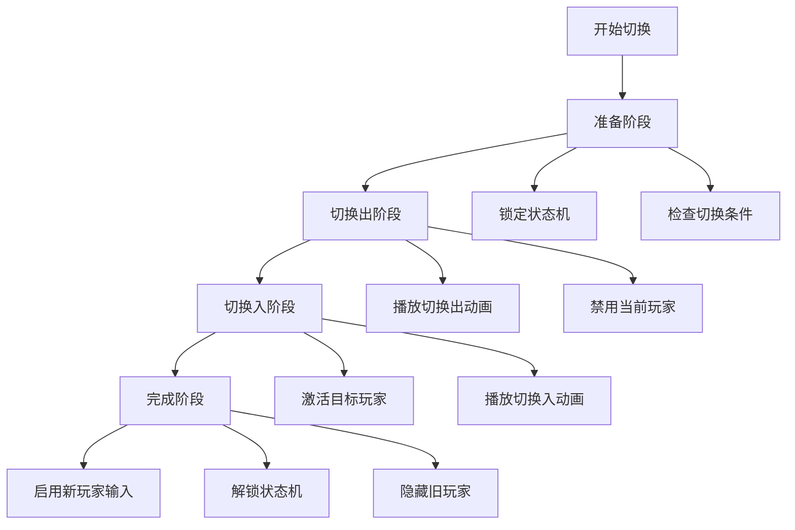

# Unity 3D 角色动作游戏架构文档

## 1. 项目概述

本项目是一个基于 Unity 3D 的角色动作游戏，采用 Universal Render Pipeline (URP) 渲染管线。项目实现了多角色切换系统、状态机驱动的角色控制、依赖注入框架等核心功能。

### 1.1 技术栈
- **引擎**: Unity 3D (URP 渲染管线)
- **编程语言**: C# 10.0
- **依赖注入**: VContainer
- **状态管理**: 自定义状态机模式
- **事件系统**: 自定义事件总线
- **包管理**: NuGet For Unity
- **第三方库**: 
  - R3 (响应式编程)
  - MemoryPack (序列化)
  - ZLinq (LINQ 扩展)

## 2. 整体架构设计

### 2.1 架构模式
项目采用 **分层架构 + 依赖注入 + 状态机模式** 的组合设计：

```
┌─────────────────────────────────────────────────────────────┐
│                        表现层 (View)                        │
│  ┌─────────────┐  ┌─────────────┐  ┌─────────────┐       │
│  │   Animator  │  │   Camera    │  │     UI      │       │
│  └──────┬──────┘  └──────┬──────┘  └──────┬──────┘       │
│         │                │                │                │
│         └────────────────┴────────────────┘                │
│                              │                              │
├──────────────────────────────┼──────────────────────────────┤
│                              │                              │
│                        控制层 (Controller)                  │
│  ┌─────────────┐  ┌─────────────┐  ┌─────────────┐       │
│  │PlayerManager│  │InputSystem  │  │EventBus     │       │
│  └──────┬──────┘  └──────┬──────┘  └──────┬──────┘       │
│         │                │                │                │
│         └────────────────┴────────────────┘                │
│                              │                              │
├──────────────────────────────┼──────────────────────────────┤
│                              │                              │
│                        模型层 (Model)                       │
│  ┌─────────────┐  ┌─────────────┐  ┌─────────────┐       │
│  │ PlayerInfo  │  │  GameConfig │  │  TeamInfo   │       │
│  └─────────────┘  └─────────────┘  └─────────────┘       │
│                                                            │
└─────────────────────────────────────────────────────────────┘
```

### 2.2 核心设计原则

1. **单一职责原则**: 每个类只负责一个功能领域
2. **依赖倒置原则**: 通过接口和依赖注入降低耦合
3. **开闭原则**: 通过状态机模式支持新状态的扩展
4. **接口隔离原则**: 细粒度的接口设计，如 `IPlayerManager`、`IStateMachine`

## 3. 系统架构详解

### 3.1 依赖注入系统 (DI System)

#### 3.1.1 核心组件
- **PersonalLifeTimeScope**: 主要的依赖注入容器配置
- **GameRoot**: 应用程序入口点，负责初始化流程

#### 3.1.2 注册的服务
```csharp
// 配置和服务注册
builder.RegisterInstance(Config);
builder.Register<SceneLoader>(Lifetime.Singleton);
builder.Register<IntroPlayer>(Lifetime.Singleton);

// 玩家管理系统
builder.Register<PlayerManagerService>(Lifetime.Singleton).As<IPlayerManager>();
builder.Register<StateMachineFactory>(Lifetime.Singleton).As<IStateMachineFactory>();
builder.Register<PlayerSwitchManager>(Lifetime.Singleton).As<IPlayerSwitchManager>();
builder.Register<PlayerObjectPool>(Lifetime.Singleton).As<IPlayerObjectPool>();

// 向后兼容
builder.Register<PlayerManager>(Lifetime.Singleton);
```

### 3.2 玩家管理系统 (Player Management System)

#### 3.2.1 架构演进
系统经历了从 **单例模式** 到 **依赖注入** 的架构升级：

**旧架构** (单例模式):
```csharp
public class PlayerManager : SingletonBase<PlayerManager>
{
    // 直接访问单例
    PlayerManager.Instance.SwitchNextPlayer();
}
```

**新架构** (依赖注入):
```csharp
public class PlayerManagerService : IPlayerManager
{
    [Inject] private readonly PlayerManager _playerManager;
    // 通过接口访问，支持测试和mock
}
```

#### 3.2.2 核心接口设计
```csharp
public interface IPlayerManager
{
    PlayerController CurrentPlayer { get; }
    IReadOnlyList<PlayerController> PlayerControllers { get; }
    
    void Initialize();
    void SwitchNextPlayer();
    void SwitchToPlayer(int playerIndex);
    void AddPlayer(PlayerController playerController);
    
    bool CanSwitchPlayer();
    event Action<PlayerController> OnPlayerSwitched;
}
```

#### 3.2.3 双轨切换系统
支持新旧两种切换方式，确保向后兼容：

1. **新系统**: 使用 `PlayerSwitchManager` 进行动画驱动的平滑切换
2. **旧系统**: 直接的状态切换，用于回滚和兼容性

### 3.3 状态机系统 (State Machine System)

#### 3.3.1 状态机架构
采用 **分层状态机** 设计：

```
IStateMachine (接口)
    ↑
StateMachine (实现)
    ↑
BaseState (基类)
    ↑
具体状态类 (IdleState, WalkState, AttackState等)
```

#### 3.3.2 状态机工厂模式
```csharp
public interface IStateMachineFactory
{
    IStateMachine CreateStateMachine(PlayerController playerController);
}

public class StateMachineFactory : IStateMachineFactory
{
    public IStateMachine CreateStateMachine(PlayerController playerController)
    {
        // 创建并配置状态机
        var stateMachine = new StateMachine(playerController, 
            characterController, animator);
        
        // 注册所有状态
        RegisterStates(stateMachine);
        return stateMachine;
    }
}
```

#### 3.3.3 性能监控
集成性能监控，追踪状态切换频率和执行时间：
```csharp
public class StateMachinePerformanceMonitor
{
    public void RecordStateUpdate(IState state, Action stateUpdate)
    {
        // 记录状态执行时间和频率
    }
}
```

### 3.4 角色切换系统 (Player Switch System)

#### 3.4.1 切换流程设计
采用 **四阶段切换流程**：



#### 3.4.2 协程管理
使用专门的协程运行器管理切换过程：
```csharp
public class CoroutineRunner : MonoBehaviour
{
    // 专门用于运行切换协程
}

// 切换管理器中使用
var coroutineRunner = new GameObject("PlayerSwitchCoroutine")
    .AddComponent<CoroutineRunner>();
coroutineRunner.StartCoroutine(PerformPlayerSwitch(coroutineRunner));
```

### 3.5 输入系统 (Input System)

#### 3.5.1 新输入系统
基于 Unity 的新输入系统，支持：
- 移动输入 (WASD/方向键)
- 攻击输入 (鼠标/键盘)
- 角色切换 (空格键)
- 特殊技能输入

#### 3.5.2 事件驱动设计
```csharp
public class InputSystem : SingletonBase<InputSystem>
{
    public event Action<InputAction.CallbackContext> OnMovePerformed;
    public event Action<InputAction.CallbackContext> OnAttackEvent;
    public event Action<InputAction.CallbackContext> SwitchCharacterEvent;
    public event Action<InputAction.CallbackContext> OnBigSkillEvent;
}
```

### 3.6 事件系统 (Event System)

#### 3.6.1 事件总线模式
```csharp
public class EventBus : SingletonBase<EventBus>
{
    private readonly Dictionary<Type, object> _events = new();
    
    public GameEvent<T> GetGameEvent<T>()
    {
        var type = typeof(T);
        if (!_events.ContainsKey(type)) 
            _events[type] = new GameEvent<T>();
        return (GameEvent<T>)_events[type];
    }
}
```

#### 3.6.2 响应式事件
使用 R3 库实现响应式编程：
```csharp
public static class GameEvents
{
    public static Subject<InputEvent> OnInput;
    public static Subject<PlayerSwitchCompletedEvent> OnPlayerSwitchCompleted;
}
```

## 4. 数据模型设计

### 4.1 ScriptableObject 配置
使用 ScriptableObject 存储游戏配置：

```csharp
[CreateAssetMenu(menuName = "Game/Config")]
public class GameConfig : ScriptableObject
{
    public string gameName = "Demo";
    public int gameVersion = 1;
    public string startSceneName = "Start";
}

[CreateAssetMenu(menuName = "Game/PlayerInfo")]
public class PlayerInfo : ScriptableObject
{
    public GameObject Prefab;
    public int MaxHP;
    public string PlayerName;
}

[CreateAssetMenu(menuName = "Game/TeamInfo")]
public class TeamInfo : ScriptableObject
{
    public PlayerInfo[] PlayerInfoList = new PlayerInfo[3];
}
```

### 4.2 数据驱动设计
- **角色配置**: 通过 ScriptableObject 配置角色属性
- **团队配置**: 支持 3 人小队配置
- **游戏配置**: 集中管理游戏参数

## 5. 工具类和辅助功能

### 5.1 单例基类
```csharp
public abstract class SingletonBase<T> where T : class, new()
{
    private static T _instance;
    public static T Instance => _instance ??= new T();
}
```

### 5.2 调试工具
```csharp
public class DebugX : SingletonBase<DebugX>
{
    public void Log(string message) { /* 自定义日志 */ }
    public void LogWarning(string message) { /* 警告日志 */ }
    public void LogError(string message) { /* 错误日志 */ }
}
```

### 5.3 更新管理器
```csharp
public interface IUpdateManager
{
    void RegisterUpdate(Action updateMethod);
    void UnregisterUpdate(Action updateMethod);
}
```

## 6. 测试架构

### 6.1 单元测试
- **PlayerManagerTests**: 测试玩家管理功能
- **StateMachineTests**: 测试状态机逻辑
- **依赖注入测试**: 验证服务注册和解析

### 6.2 Mock 支持
通过接口设计支持单元测试：
```csharp
// 可以轻松mock IPlayerManager 进行测试
public class MockPlayerManager : IPlayerManager
{
    // 测试实现
}
```

## 7. 性能优化

### 7.1 对象池
```csharp
public interface IPlayerObjectPool
{
    PlayerController GetPlayer();
    void ReturnPlayer(PlayerController player);
}
```

### 7.2 状态机性能监控
- 状态切换频率监控
- 状态执行时间统计
- 性能瓶颈识别

### 7.3 内存管理
- 及时释放事件订阅
- 协程生命周期管理
- 对象池复用

## 8. 扩展性设计

### 8.1 新角色支持
1. 创建新的 PlayerInfo ScriptableObject
2. 配置角色预制体和属性
3. 添加到 TeamInfo 配置中

### 8.2 新状态支持
1. 继承 BaseState 创建新状态
2. 在状态工厂中注册新状态
3. 在 PlayerController 中配置状态转换条件

### 8.3 新输入支持
1. 在 InputSystem_Actions 中添加新动作
2. 在 InputSystem 中添加事件处理
3. 在相应的状态中处理输入

## 9. 最佳实践

### 9.1 代码组织
- **命名规范**: 使用清晰的命名空间组织
- **文件夹结构**: 按功能模块组织代码
- **接口优先**: 先定义接口，再实现具体类

### 9.2 依赖管理
- **构造函数注入**: 优先使用构造函数注入
- **接口依赖**: 依赖接口而非具体实现
- **生命周期管理**: 合理配置服务生命周期

### 9.3 状态管理
- **状态原子性**: 每个状态只负责一个行为
- **状态转换**: 明确定义状态转换条件
- **错误处理**: 在状态中处理异常情况

## 10. 部署和配置

### 10.1 场景配置
- **GameMain**: 游戏主场景，负责玩家初始化
- **依赖注入**: 在场景中配置 PersonalLifeTimeScope
- **输入系统**: 配置 InputSystem_Actions

### 10.2 构建设置
- **脚本编译**: 使用 C# 10.0 语言版本
- **包管理**: 通过 NuGet 管理第三方依赖
- **平台配置**: 支持多平台构建

## 11. 总结

本项目展示了一个现代化的 Unity 游戏架构设计，通过以下关键技术实现了高内聚、低耦合的代码结构：

1. **依赖注入**: 使用 VContainer 实现控制反转
2. **状态机模式**: 灵活的角色行为管理
3. **接口驱动**: 支持测试和扩展
4. **事件系统**: 解耦组件间通信
5. **性能监控**: 实时性能追踪和优化


---

## 12. 具体代码使用示例

### 12.1 基础系统初始化

#### 12.1.1 场景设置
在 Unity 场景中创建空 GameObject，添加 `PersonalLifeTimeScope` 组件：

```csharp
// 在 Inspector 中配置
public class PersonalLifeTimeScope : LifetimeScope
{
    public GameConfig Config;  // 拖入配置 ScriptableObject
    
    protected override void Configure(IContainerBuilder builder)
    {
        // 注册配置
        builder.RegisterInstance(Config);
        
        // 注册基础服务
        builder.Register<SceneLoader>(Lifetime.Singleton);
        builder.Register<IntroPlayer>(Lifetime.Singleton);
        
        // 注册玩家管理系统
        builder.Register<PlayerManagerService>(Lifetime.Singleton).As<IPlayerManager>();
        builder.RegisterEntryPoint<GameRoot>();
    }
}
```

#### 12.1.2 配置 ScriptableObject 创建
```csharp
// 创建 GameConfig
[CreateAssetMenu(menuName = "Game/Config")]
public class GameConfig : ScriptableObject
{
    public string gameName = "Demo";
    public string startSceneName = "Start";
    public string videoName = "Demo.mp4";
}

// 创建 TeamInfo
[CreateAssetMenu(menuName = "Game/TeamInfo")]
public class TeamInfo : ScriptableObject
{
    public PlayerInfo[] PlayerInfoList = new PlayerInfo[3];
}
```

### 12.2 玩家管理系统使用

#### 12.2.1 传统单例方式
```csharp
public class GameMain : MonoBehaviour
{
    public TeamInfo teamInfo;
    public Transform spawnPoint;
    
    private void Awake()
    {
        // 初始化管理器
        PlayerManager.Instance.Init();
        
        // 创建玩家
        for (int i = 0; i < teamInfo.PlayerInfoList.Length; i++)
        {
            PlayerInfo playerInfo = teamInfo.PlayerInfoList[i];
            GameObject go = Instantiate(playerInfo.Prefab, spawnPoint.position, Quaternion.identity);
            
            // 获取控制器并注册
            PlayerController controller = go.GetComponent<PlayerController>();
            PlayerManager.Instance.AddPlayer(controller);
            
            // 设置第一个为当前玩家
            if (i == 0)
            {
                PlayerManager.Instance.CurrentPlayer = controller;
                controller.SetInputActive(true);
            }
            else
            {
                controller.SetInputActive(false);
            }
        }
    }
}
```

#### 12.2.2 依赖注入方式
```csharp
public class MyGameService
{
    private readonly IPlayerManager _playerManager;
    
    [Inject]
    public MyGameService(IPlayerManager playerManager)
    {
        _playerManager = playerManager;
    }
    
    public void SwitchToNextPlayer()
    {
        if (_playerManager.CanSwitchPlayer())
        {
            _playerManager.SwitchNextPlayer();
            Debug.Log($"切换到玩家: {_playerManager.CurrentPlayer.name}");
        }
    }
    
    public void SubscribeToPlayerSwitch()
    {
        _playerManager.OnPlayerSwitched += OnPlayerSwitched;
    }
    
    private void OnPlayerSwitched(PlayerController newPlayer)
    {
        Debug.Log($"玩家切换完成: {newPlayer.name}");
    }
}
```

### 12.3 状态机系统使用

#### 12.3.1 创建自定义状态
```csharp
public class MyCustomState : BaseState
{
    private float _duration = 2f;
    private float _timer;
    
    public override void OnEnter()
    {
        base.OnEnter();
        _timer = 0f;
        Debug.Log("进入自定义状态");
        
        // 播放动画
        stateMachine._animator.Play("MyCustomAnimation");
    }
    
    public override void Update()
    {
        base.Update();
        _timer += Time.deltaTime;
        
        // 2秒后自动切换到Idle状态
        if (_timer >= _duration)
        {
            stateMachine.ChangeState<IdleState>();
        }
    }
    
    public override void OnExit()
    {
        base.OnExit();
        Debug.Log("退出自定义状态");
    }
}
```

#### 12.3.2 在 PlayerController 中使用状态机
```csharp
public class PlayerController : MonoBehaviour
{
    public StateMachine _stateMachine;
    
    private void Awake()
    {
        // 创建状态机（通过工厂或手动）
        _stateMachine = new StateMachine(this, _characterController, _animator);
        
        // 注册状态
        _stateMachine.RegisterState(new IdleState());
        _stateMachine.RegisterState(new WalkState());
        _stateMachine.RegisterState(new MyCustomState()); // 注册自定义状态
        
        // 设置初始状态
        _stateMachine.ChangeState<IdleState>();
    }
    
    private void Update()
    {
        // 更新状态机
        _stateMachine.Update();
        
        // 根据输入切换状态
        if (Input.GetKeyDown(KeyCode.Space))
        {
            _stateMachine.ChangeState<MyCustomState>();
        }
    }
}
```

### 12.4 角色切换系统使用

#### 12.4.1 监听切换事件
```csharp
public class CameraController : MonoBehaviour
{
    private IPlayerManager _playerManager;
    
    private void Start()
    {
        // 获取玩家管理器
        _playerManager = PlayerManager.Instance;
        
        // 订阅切换事件
        _playerManager.OnPlayerSwitched += OnPlayerSwitched;
    }
    
    private void OnPlayerSwitched(PlayerController newPlayer)
    {
        // 切换相机目标
        CameraSystem.Instance.SetTarget(newPlayer.transform);
        
        // 更新UI
        UIManager.Instance.ShowPlayerInfo(newPlayer);
    }
    
    private void OnDestroy()
    {
        // 取消订阅
        _playerManager.OnPlayerSwitched -= OnPlayerSwitched;
    }
}
```

#### 12.4.2 自定义切换逻辑
```csharp
public class MyPlayerSwitchManager : IPlayerSwitchManager
{
    public bool IsSwitching { get; private set; }
    
    public void StartPlayerSwitch(PlayerController fromPlayer, PlayerController toPlayer)
    {
        if (IsSwitching) return;
        
        // 执行自定义切换逻辑
        PerformCustomSwitch(fromPlayer, toPlayer);
    }
    
    private async void PerformCustomSwitch(PlayerController fromPlayer, PlayerController toPlayer)
    {
        IsSwitching = true;
        
        // 1. 播放特效
        await PlaySwitchEffect(fromPlayer);
        
        // 2. 禁用旧玩家
        fromPlayer.SetInputActive(false);
        
        // 3. 激活新玩家
        toPlayer.gameObject.SetActive(true);
        
        // 4. 播放入场动画
        toPlayer._stateMachine.ChangeState<SwitchInState>();
        
        // 5. 启用新玩家
        toPlayer.SetInputActive(true);
        
        // 6. 隐藏旧玩家
        fromPlayer.gameObject.SetActive(false);
        
        IsSwitching = false;
    }
}
```

### 12.5 输入系统使用

#### 12.5.1 处理输入事件
```csharp
public class CombatSystem : MonoBehaviour
{
    private void OnEnable()
    {
        // 订阅输入事件
        InputSystem.Instance.OnAttackEvent += OnAttack;
        InputSystem.Instance.OnBigSkillEvent += OnBigSkill;
    }
    
    private void OnDisable()
    {
        // 取消订阅
        InputSystem.Instance.OnAttackEvent -= OnAttack;
        InputSystem.Instance.OnBigSkillEvent -= OnBigSkill;
    }
    
    private void OnAttack(InputAction.CallbackContext context)
    {
        var currentPlayer = PlayerManager.Instance.CurrentPlayer;
        if (currentPlayer != null)
        {
            // 切换到攻击状态
            currentPlayer._stateMachine.ChangeState<AttackState>();
        }
    }
    
    private void OnBigSkill(InputAction.CallbackContext context)
    {
        var currentPlayer = PlayerManager.Instance.CurrentPlayer;
        if (currentPlayer != null)
        {
            // 检查技能冷却
            if (CanUseBigSkill())
            {
                currentPlayer._stateMachine.ChangeState<BigSkillState>();
            }
        }
    }
}
```

#### 12.5.2 读取输入值
```csharp
public class MovementController : MonoBehaviour
{
    private void Update()
    {
        // 读取移动输入
        Vector2 moveInput = InputSystem.Instance.MoveDirectionInput;
        
        // 处理移动逻辑
        if (moveInput.magnitude > 0.1f)
        {
            MoveCharacter(moveInput);
        }
        
        // 检查特殊输入
        if (InputSystem.Instance.Run)
        {
            Run();
        }
        
        if (InputSystem.Instance.Walk)
        {
            Walk();
        }
    }
}
```

### 12.6 事件系统使用

#### 12.6.1 发布事件
```csharp
public class GameEventPublisher : MonoBehaviour
{
    public void PublishPlayerDamaged(int damage, PlayerController player)
    {
        // 使用事件总线发布事件
        var damageEvent = EventBus.Instance.GetGameEvent<PlayerDamageEvent>();
        damageEvent.Publish(new PlayerDamageEvent
        {
            Damage = damage,
            Player = player,
            Timestamp = Time.time
        });
    }
    
    public void PublishGameStateChanged(GameState newState)
    {
        var stateEvent = EventBus.Instance.GetGameEvent<GameStateChangedEvent>();
        stateEvent.Publish(new GameStateChangedEvent
        {
            NewState = newState,
            PreviousState = CurrentGameState
        });
    }
}
```

#### 12.6.2 订阅事件
```csharp
public class GameEventSubscriber : MonoBehaviour
{
    private void OnEnable()
    {
        // 订阅玩家受伤事件
        var damageEvent = EventBus.Instance.GetGameEvent<PlayerDamageEvent>();
        damageEvent.Subscribe(OnPlayerDamaged);
        
        // 订阅游戏状态变化事件
        var stateEvent = EventBus.Instance.GetGameEvent<GameStateChangedEvent>();
        stateEvent.Subscribe(OnGameStateChanged);
    }
    
    private void OnPlayerDamaged(PlayerDamageEvent damageEvent)
    {
        Debug.Log($"玩家 {damageEvent.Player.name} 受到 {damageEvent.Damage} 点伤害");
        
        // 更新UI
        UIManager.Instance.ShowDamageNumber(damageEvent.Damage, damageEvent.Player.transform.position);
        
        // 检查玩家是否死亡
        if (damageEvent.Player.IsDead())
        {
            HandlePlayerDeath(damageEvent.Player);
        }
    }
    
    private void OnGameStateChanged(GameStateChangedEvent stateEvent)
    {
        Debug.Log($"游戏状态从 {stateEvent.PreviousState} 变为 {stateEvent.NewState}");
        
        // 根据新状态执行相应逻辑
        switch (stateEvent.NewState)
        {
            case GameState.Playing:
                Time.timeScale = 1f;
                break;
            case GameState.Paused:
                Time.timeScale = 0f;
                break;
            case GameState.GameOver:
                ShowGameOverUI();
                break;
        }
    }
}
```

### 12.7 测试示例

#### 12.7.1 单元测试
```csharp
[TestFixture]
public class PlayerManagerTests
{
    private IPlayerManager _playerManager;
    private PlayerController _mockPlayer1;
    private PlayerController _mockPlayer2;
    
    [SetUp]
    public void Setup()
    {
        // 创建测试用的 PlayerManager
        _playerManager = new PlayerManagerService(new PlayerManager());
        
        // 创建模拟玩家
        _mockPlayer1 = CreateMockPlayer("Player1");
        _mockPlayer2 = CreateMockPlayer("Player2");
        
        // 添加玩家
        _playerManager.AddPlayer(_mockPlayer1);
        _playerManager.AddPlayer(_mockPlayer2);
        
        // 初始化
        _playerManager.Initialize();
    }
    
    [Test]
    public void SwitchNextPlayer_ShouldChangeCurrentPlayer()
    {
        // Arrange
        var initialPlayer = _playerManager.CurrentPlayer;
        
        // Act
        _playerManager.SwitchNextPlayer();
        
        // Assert
        Assert.AreNotEqual(initialPlayer, _playerManager.CurrentPlayer);
        Assert.IsTrue(_playerManager.PlayerControllers.Contains(_playerManager.CurrentPlayer));
    }
    
    [Test]
    public void CanSwitchPlayer_ShouldReturnFalse_WhenStateLocked()
    {
        // Arrange
        _playerManager.CurrentPlayer._stateMachine.Lock();
        
        // Act & Assert
        Assert.IsFalse(_playerManager.CanSwitchPlayer());
    }
    
    private PlayerController CreateMockPlayer(string name)
    {
        var gameObject = new GameObject(name);
        var player = gameObject.AddComponent<PlayerController>();
        
        // 添加必要的组件
        gameObject.AddComponent<Animator>();
        gameObject.AddComponent<CharacterController>();
        
        return player;
    }
}
```

#### 12.7.2 集成测试
```csharp
[TestFixture]
public class StateMachineIntegrationTests
{
    private PlayerController _player;
    private IStateMachine _stateMachine;
    
    [SetUp]
    public void Setup()
    {
        // 创建测试对象
        var gameObject = new GameObject("TestPlayer");
        _player = gameObject.AddComponent<PlayerController>();
        
        // 添加必要组件
        gameObject.AddComponent<Animator>();
        gameObject.AddComponent<CharacterController>();
        
        // 创建状态机
        var factory = new StateMachineFactory();
        _stateMachine = factory.CreateStateMachine(_player);
    }
    
    [Test]
    public void StateMachine_ShouldTransitionBetweenStates()
    {
        // 初始状态应该是 Idle
        Assert.IsInstanceOf<IdleState>(_stateMachine.CurrentState);
        
        // 切换到 Walk 状态
        _stateMachine.ChangeState<WalkState>();
        
        // 验证状态切换
        Assert.IsInstanceOf<WalkState>(_stateMachine.CurrentState);
        
        // 切换回 Idle 状态
        _stateMachine.ChangeState<IdleState>();
        
        // 验证状态切换
        Assert.IsInstanceOf<IdleState>(_stateMachine.CurrentState);
    }
}
```

### 12.8 调试和性能监控

#### 12.8.1 使用调试工具
```csharp
public class DebugExample : MonoBehaviour
{
    private void Start()
    {
        // 使用 DebugX 进行调试
        DebugX.Instance.Log("游戏开始");
        DebugX.Instance.LogWarning("这是一个警告");
        DebugX.Instance.LogError("这是一个错误");
        
        // 条件日志
        if (Application.isEditor)
        {
            DebugX.Instance.Log("在编辑器中运行");
        }
    }
    
    private void Update()
    {
        // 性能关键代码的调试
        if (Time.frameCount % 60 == 0) // 每秒一次
        {
            DebugX.Instance.Log($"FPS: {1f / Time.deltaTime:F1}");
        }
    }
}
```

#### 12.8.2 性能监控
```csharp
public class PerformanceMonitorExample : MonoBehaviour
{
    private StateMachinePerformanceMonitor _monitor;
    
    private void Start()
    {
        // 获取状态机性能监控器
        var player = PlayerManager.Instance.CurrentPlayer;
        _monitor = player._stateMachine.PerformanceMonitor;
        
        // 设置性能阈值
        _monitor.SetPerformanceThreshold(0.016f); // 60 FPS = 16.67ms
    }
    
    private void Update()
    {
        // 检查性能问题
        if (_monitor.HasPerformanceIssues())
        {
            DebugX.Instance.LogWarning("检测到性能问题！");
            
            // 获取详细的性能报告
            var report = _monitor.GetPerformanceReport();
            foreach (var stateInfo in report.StatePerformances)
            {
                DebugX.Instance.Log($"{stateInfo.StateName}: {stateInfo.AverageExecutionTime:F3}ms");
            }
        }
    }
}
```

这些示例代码展示了如何在实际项目中使用各个系统，从基础的初始化到复杂的业务逻辑实现，帮助开发者更好地理解和应用项目架构。
架构设计遵循 SOLID 原则，支持水平扩展和垂直扩展，为后续功能开发提供了坚实的基础。